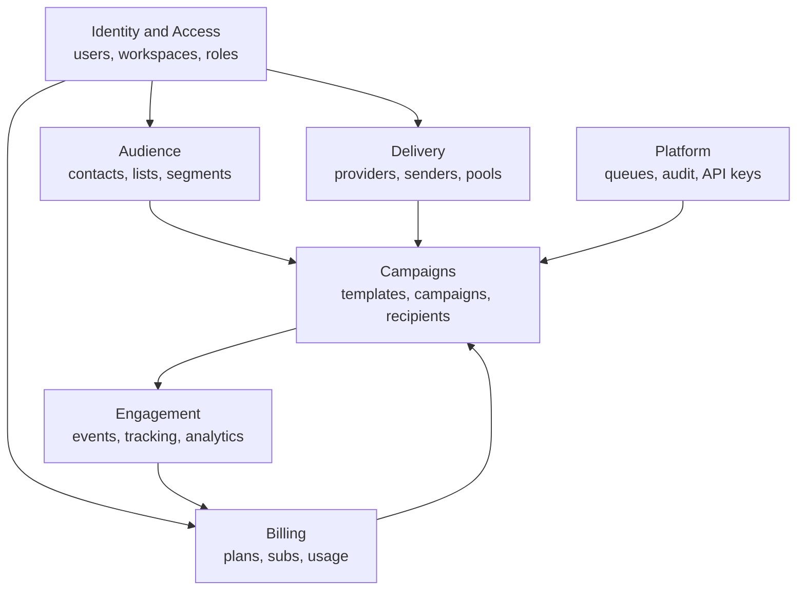

<!-- Product, domain model, MVP scope -->
> **Source of truth note.** This file is extracted from the Technical Design Document v0.1. Where it conflicts with `docs/17-review-findings.md` or `INVARIANTS.md`, those two files win — they contain the corrections from the independent adversarial review. Implement the corrected design, not the original where they differ.

# 1. Product architecture and domain model

The system has seven bounded contexts. Each owns its tables, exposes a service interface, and never reaches into another context's tables directly. This is the boundary that lets a monolith stay maintainable.



Billing points back at Campaigns because entitlements gate sending. Engagement points at Billing because metering is driven by accepted sends.

## Core aggregates

| Aggregate | Root entity | Owns | Invariant it protects |
| --- | --- | --- | --- |
| Workspace | `workspaces` | members, invitations, settings | Every tenant resource has exactly one workspace |
| Contact | `contacts` | tags, list memberships | Email is unique per workspace, case-folded |
| Suppression | `suppressions` | reason, source, scope | A suppressed address is never sent to, ever |
| Sender account | `sender_accounts` | identities, credentials ref, health | Credentials are never readable by the API layer in plaintext |
| Sending pool | `sending_pools` | members, weights, strategy | A pool only routes to verified, healthy senders |
| Campaign | `campaigns` | recipients, settings, schedule | Recipients are frozen at launch, never re-queried mid-send |
| Subscription | `subscriptions` | items, entitlements | Provider webhook is the only writer of status |
| Usage period | `usage_aggregates` | counters per metric | A recipient is counted at most once per campaign |

## The three state machines that matter

Everything else is CRUD. These three carry the product's correctness.

1. **Campaign lifecycle** — section 11.
2. **Recipient lifecycle** — section 11. This is the one that must be right.
3. **Subscription lifecycle** — section 7.

## What this product is not

Naming the non-goals now prevents scope creep later.

- **Not an ESP.** We do not own IPs, warm-up, or deliverability. We advise, we do not deliver.
- **Not a CRM.** Contacts carry custom fields, not deal pipelines or activity timelines.
- **Not a page builder.** Templates are email HTML. Landing pages and forms are a future product surface.
- **Not a cold-outreach tool.** Consent-based sending only. This is an enforced product constraint, not a disclaimer, and it is what keeps provider accounts and payment processing alive. Section 15.

## Personas and the permissions they need

| Persona | Typical action | Minimum role |
| --- | --- | --- |
| Owner | Billing, plan change, workspace deletion | `owner` |
| Marketing manager | Create and launch campaigns, manage audience | `admin` |
| Copywriter | Edit templates, build draft campaigns, cannot launch | `editor` |
| Analyst | Read analytics and logs only | `viewer` |
| Machine client | API-driven contact sync, transactional-style sends | API key with scopes |

The `editor` cannot launch is deliberate. Launch is the irreversible, billable, reputation-affecting action, so it needs a distinct permission (`campaign:launch`) rather than riding along with `campaign:write`.


---

# 24. MVP, scaling profile, and cost

## 24.1 MUST / SHOULD / NICE / FUTURE

The test applied throughout: **can a paying customer run a real campaign to a real list and trust the numbers afterwards?** Anything that is not load-bearing for that sentence is not MVP.

### MUST HAVE — the launch set

| Area | In MVP |
| --- | --- |
| Identity | Email and password auth, email verification, sessions with refresh, password reset |
| Workspace | Workspace creation, invitations, four roles, the full permission matrix, audit log |
| Audience | Contact CRUD, lists, tags, CSV and XLSX import with progress and error report, suppressions, fixed-predicate segments |
| Providers | SES, SMTP, SendGrid; credential vaulting; connection health; sender accounts and identity verification |
| Templates | HTML editor, merge tags with defaults, immutable published versions, plain-text fallback, preview and test-send |
| Campaigns | Seven-step wizard, recipient snapshot at launch, schedule, launch, pause, resume, cancel, clone, retry-failed, progress |
| Sending | Single-sender sending plus round-robin and failover across a pool; per-connection rate limiting |
| Tracking | Open pixel and click redirect with HMAC tokens, one-click unsubscribe, `List-Unsubscribe` headers |
| Ingestion | Provider webhook ingestion for delivered, bounce, complaint; automatic suppression on hard bounce and complaint |
| Analytics | Campaign stats, link stats, daily stats, workspace overview; CSV export |
| Billing | Stripe checkout, subscription lifecycle, entitlements, usage metering, plan change, dunning ladder, invoices, payment method |
| Security | Tenant isolation at all four layers, rate limiting, sanitisation, the anti-abuse launch set from section 15 |
| Ops | Two environments, CI/CD, backups with a tested restore, Sentry, structured logs, the trace-id chain |

### SHOULD HAVE — first quarter after launch

Weighted routing. Mailgun and Brevo adapters. Public API with scoped keys. Outbound webhooks. Device and client analytics. Saved segments with dynamic re-evaluation. Team activity feed. Scheduled send in recipient local timezone. A block-based template editor. Bounce categorisation beyond hard and soft. Deliverability warnings on the review step.

### NICE TO HAVE — opportunistic

A/B subject testing. Send-time optimisation. Contact engagement scoring surfaced in the UI. Template gallery. Multi-currency pricing. Annual plans with a discount. SSO for the top plan. Custom tracking domains per workspace. Inbox-preview rendering.

### FUTURE — deliberate, dated, not now

Automations and drip workflows. Adaptive routing. Transactional-email API as a separate product surface. Landing pages and forms. Dedicated IP management. Deliverability consulting tooling such as DMARC report ingestion and seed-list testing. White-label and agency sub-accounts. ClickHouse or an equivalent for analytics. Mobile app.

### Why automations are cut

You listed automations in the core feature set and as phase 14, and the schema is sketched below, so this is not an oversight — it is a judgement, and here it is with reasons.

An automation engine is not a feature added to a campaign engine; it is a second execution engine with its own scheduler, its own state machine, its own idempotency problems and its own debugging surface. A campaign has one audience resolved once, at launch. An automation has a continuously arriving population, per-contact position in a graph, wait states measured in days, re-entry rules, and the question of what happens when someone edits step three while four thousand contacts are sitting in step two. Every failure mode in section 19 recurs, in a form where the affected contact may be mid-flight for a week.

The second reason is commercial. Automations are what customers ask about in demos and what they use in month four, after the campaign tool has already proven itself. Shipping a weak automation builder alongside a strong campaign engine makes the whole product feel unfinished. Shipping the campaign engine alone, done well, makes it feel focused. Build automations when you have paying customers telling you which three triggers they actually want, rather than the twelve you would guess.

### Deferred automations schema sketch

Sections 4 and 22 forward-reference this. It is a sketch to keep the core schema forward-compatible, not a design to build from.

```sql
CREATE TABLE automations (
  id              UUID PRIMARY KEY,
  workspace_id    UUID NOT NULL REFERENCES workspaces(id) ON DELETE CASCADE,
  name            TEXT NOT NULL,
  status          automation_status NOT NULL DEFAULT 'draft',
  trigger_kind    automation_trigger NOT NULL,
  trigger_config  JSONB NOT NULL DEFAULT '{}',
  reentry_policy  TEXT NOT NULL DEFAULT 'once',
  version         INTEGER NOT NULL DEFAULT 1,
  published_at    TIMESTAMPTZ,
  created_by      UUID REFERENCES users(id),
  created_at      TIMESTAMPTZ NOT NULL DEFAULT now(),
  updated_at      TIMESTAMPTZ NOT NULL DEFAULT now()
);
CREATE INDEX ix_automations_ws_status ON automations (workspace_id, status);

-- Steps are versioned with the automation. A run pins automation_version
-- so that editing a live automation cannot rewrite the path of in-flight contacts.
CREATE TABLE automation_steps (
  id                  UUID PRIMARY KEY,
  automation_id       UUID NOT NULL REFERENCES automations(id) ON DELETE CASCADE,
  automation_version  INTEGER NOT NULL,
  parent_step_id      UUID REFERENCES automation_steps(id),
  branch_key          TEXT,
  position            INTEGER NOT NULL,
  kind                automation_step_kind NOT NULL,  -- send | wait | condition | tag | goal | exit
  config              JSONB NOT NULL DEFAULT '{}',
  created_at          TIMESTAMPTZ NOT NULL DEFAULT now(),
  UNIQUE (automation_id, automation_version, parent_step_id, branch_key, position)
);

CREATE TABLE automation_runs (
  id                  UUID PRIMARY KEY,
  workspace_id        UUID NOT NULL REFERENCES workspaces(id) ON DELETE CASCADE,
  automation_id       UUID NOT NULL REFERENCES automations(id) ON DELETE CASCADE,
  automation_version  INTEGER NOT NULL,
  contact_id          UUID NOT NULL REFERENCES contacts(id) ON DELETE CASCADE,
  current_step_id     UUID REFERENCES automation_steps(id),
  state               automation_run_state NOT NULL DEFAULT 'active',
  wake_at             TIMESTAMPTZ,
  entered_at          TIMESTAMPTZ NOT NULL DEFAULT now(),
  completed_at        TIMESTAMPTZ
);
-- Enforces the once reentry policy structurally rather than in application code.
CREATE UNIQUE INDEX uq_run_once
  ON automation_runs (automation_id, contact_id)
  WHERE state IN ('active','waiting');
-- The scheduler claim index: this is the hot path.
CREATE INDEX ix_runs_wake
  ON automation_runs (wake_at)
  WHERE state = 'waiting';

CREATE TABLE automation_events (
  id            BIGSERIAL PRIMARY KEY,
  workspace_id  UUID NOT NULL,
  run_id        UUID NOT NULL REFERENCES automation_runs(id) ON DELETE CASCADE,
  step_id       UUID REFERENCES automation_steps(id),
  kind          TEXT NOT NULL,
  payload       JSONB NOT NULL DEFAULT '{}',
  occurred_at   TIMESTAMPTZ NOT NULL DEFAULT now()
) PARTITION BY RANGE (occurred_at);
```

The two load-bearing ideas: runs pin an automation version so edits cannot rewrite in-flight paths, and the partial unique index on active runs makes double-entry structurally impossible rather than a thing a worker must remember to check. Sends emitted by a step reuse the `email-send` queue and the same billable-unit rule from section 8 — an automation email is one metered send, identically.

## 24.2 Scaling profile

Two axes matter and they are not the same axis. Registered users mostly stress the API, Postgres row counts and the dashboard. Emails per day stresses the dispatcher, Redis, provider rate limits and the event tables. A product with a thousand users each sending a million a month is a very different machine from a hundred thousand users on a free tier.

### By user count

| Users | Shape | What breaks first | Response |
| --- | --- | --- | --- |
| 1,000 | Single ECS service per process type, 2 tasks each; RDS db.t4g.medium; cache.t4g.micro | Nothing. You are massively over-provisioned and that is correct. | Do not optimise. Watch p99 and move on. |
| 10,000 | 3–4 API tasks, 4–6 send workers; db.m7g.large with a read replica; cache.t4g.small | Dashboard queries against raw `email_events`; N+1 patterns in list endpoints | Route all analytics reads to rollup tables and the replica. Add cursor pagination everywhere. |
| 100,000 | 8–12 API tasks behind ALB; db.m7g.2xlarge plus two replicas; PgBouncer in transaction mode; cache.m7g.large with a replica | Postgres connection count, then write throughput on `contacts` and `email_events` | PgBouncer becomes mandatory, not optional. Partition `campaign_recipients` by hash of `campaign_id`. Separate the Redis instance used by BullMQ from the one used for rate limiting and caching. |
| 1,000,000 | Multi-AZ everywhere; connection pooling tiered; analytics on dedicated replicas; Redis cluster mode | Single-writer Postgres. This is the wall. | Shard by workspace across writer instances, routed at the repository layer — which is possible precisely because every repository method already takes `WorkspaceScope`. Move `email_events` to a column store. Expect this to be a quarter of work, and expect to know a year in advance that it is coming. |

### By send volume

| Sends per day | Dispatcher shape | Bottleneck | Response |
| --- | --- | --- | --- |
| 10,000 | 1 dispatcher tick per campaign, 2 send workers at concurrency 10 | Provider rate limits, not you | Nothing. Respect the buckets. |
| 100,000 | 4 send workers at concurrency 25 | Redis round-trips per job; per-send row update on `campaign_recipients` | Batch state transitions where the provider supports `sendBatch`. Increase the dispatcher window from 5,000 to 20,000. |
| 1,000,000 | 12–20 send workers; dispatcher as its own service | `campaign_recipients` update throughput and index bloat; `email_events` insert rate | Hash-partition `campaign_recipients`. Batch event inserts through a Redis buffer flushed every second rather than one insert per event. Aggressive autovacuum settings on the hot tables. |
| 10,000,000 | 50+ send workers; Redis cluster; dispatcher sharded by campaign hash | Postgres write amplification on every path at once | At this point the event stream leaves Postgres. Raw events go to S3 as Parquet plus a column store for queries; Postgres keeps only recipient state and rollups. Also: at this volume your customers are large enough that per-workspace infrastructure isolation becomes a product offering rather than an engineering problem. |

**The honest caveat.** The 1M-user and 10M-send rows are directionally right but not measured. Treat them as a map of where the cliffs are, and replace each row with real numbers from phase 12 as you reach it. Architectures that are planned three orders of magnitude ahead usually get the wrong three.

## 24.3 Cost categories

**These are shapes, not quotes.** AWS pricing varies by region, commitment and the month you read it; Middle East regions typically run above us-east-1. Everything below is an order of magnitude to plan against, in USD per month, and you should rebuild it in the AWS calculator for your actual region before it touches a budget.

| Category | Development | Staging | Small prod | Medium prod | Large prod |
| --- | --- | --- | --- | --- | --- |
| Compute (ECS Fargate ARM64) | local, \~0 | 1 task per service, minimal | \~150–300 | \~600–1,200 | \~3,000–8,000 |
| RDS PostgreSQL | local container | t4g.small single-AZ | t4g.medium Multi-AZ, \~150–250 | m7g.large Multi-AZ plus replica, \~600–900 | m7g.2xlarge plus replicas, \~2,500–5,000 |
| ElastiCache Redis | local container | t4g.micro | t4g.small, \~30–60 | m7g.large with replica, \~250–400 | cluster mode, \~1,000–2,500 |
| S3 | negligible | negligible | \~10–30 | \~50–150 | \~300–800 |
| CloudFront | negligible | negligible | \~10–40 | \~80–250 | \~500–2,000 |
| ALB, NAT, data transfer | 0 | \~40–60 | \~80–150 | \~200–400 | \~600–1,500 |
| Secrets Manager, KMS | negligible | \~5 | \~15–40 | \~60–150 | \~200–500 |
| Monitoring (Sentry, CloudWatch, Grafana Cloud) | free tiers | \~30 | \~100–200 | \~300–600 | \~800–2,000 |
| **Infra subtotal** | **\~0** | **\~150–250** | **\~550–1,100** | **\~2,150–4,050** | **\~9,000–22,000** |

**Costs you do not pay, and one you do.** Email delivery cost sits with your customer, not with you — that is the structural advantage of the bring-your-own-provider model and it is worth a great deal at scale. You still pay for your own transactional email (verification, invites, dunning notices), which is negligible.

**Payment processing** is a revenue-linked cost, not an infrastructure one: Stripe is roughly 2.9 percent plus a fixed fee domestically with higher rates for international cards and currency conversion, plus Stripe Tax as a percentage of transaction volume. At 100k in monthly revenue this line is larger than your entire infrastructure bill, which is the correct way to feel about the merchant-of-record trade-off in section 5 — the MoR premium is roughly two additional points on the same base, and the question is whether the compliance work you avoid is worth more than that.

**What actually moves these numbers**, in rough order of impact:

1. **NAT Gateway data processing.** The classic surprise line. Use VPC endpoints for S3, ECR, Secrets Manager and CloudWatch Logs; each one removes traffic from the NAT meter.
2. **Multi-AZ RDS.** Roughly doubles the database line. Non-negotiable in production, wasteful in staging — do not run it in staging.
3. **Event retention.** `email_events` is the fastest-growing thing you own. Retention by plan tier is a cost control as much as a pricing feature; a dropped partition is instant and free, a `DELETE` of a hundred million rows is neither.
4. **CloudWatch Logs ingestion.** Structured JSON logs at debug level in production will cost more than your API compute. Log at info, sample the noisy paths, and set retention explicitly rather than accepting never-expire.
5. **Fargate task sizing.** Workers idle at low volume. Scale send workers on queue depth rather than CPU, and let them scale to a floor of one outside sending windows.
6. **Redis memory.** Driven by BullMQ retention settings far more than by cache usage. The `removeOnComplete` bounds from section 12 are a cost control.
7. **Replicas and snapshots.** Easy to add, easy to forget. Audit quarterly.

The practical read: infrastructure is not what makes or breaks this business at any stage below large production. Payment processing, deliverability reputation and engineering time are the expensive things. Do not spend a week saving forty dollars a month.
