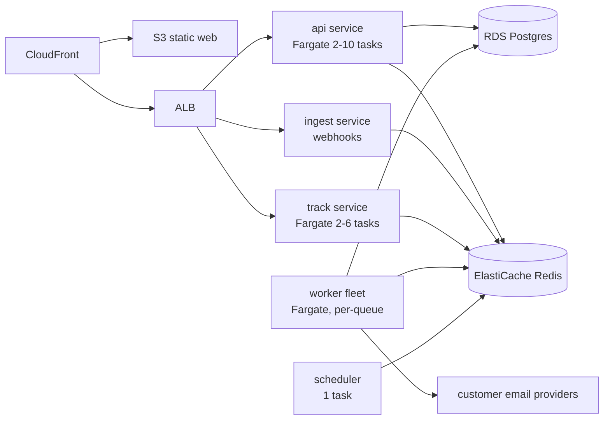

<!-- Technical architecture -->
> **Source of truth note.** This file is extracted from the Technical Design Document v0.1. Where it conflicts with `docs/17-review-findings.md` or `INVARIANTS.md`, those two files win — they contain the corrections from the independent adversarial review. Implement the corrected design, not the original where they differ.

# 2. Technical architecture

One monorepo, one shared domain layer, five deployable process types. Drizzle over Prisma. Express kept but disciplined.

## Runtime topology

Five process types, deployed separately, built from one image per app:

| Process | Scales on | Why it is separate |
| --- | --- | --- |
| `api` | Request latency, CPU | User-facing; must never be starved by batch work |
| `track` | Request rate | Open/click pixels are high-RPS, low-value, public; isolate the blast radius and cache aggressively |
| `ingest` | Request rate | Provider and payment webhooks must accept and enqueue in under 200 ms regardless of API load |
| `worker` | Queue depth | One task definition per queue group so a webhook backlog cannot starve sending |
| `scheduler` | Fixed at 1 | Leader-elected cron: campaign launches, aggregation rollups, dunning sweeps, reconciliation |

Splitting `track` and `ingest` from `api` is the one piece of service decomposition I would do on day 1. Both are unauthenticated, internet-facing, unpredictable in volume, and must not be able to take down the dashboard.

## Decision: Drizzle over Prisma

| Criterion | Prisma | Drizzle | Weight here |
| --- | --- | --- | --- |
| Type safety | Excellent, generated client | Excellent, inferred from schema | Tie |
| Raw SQL ergonomics | Escape hatch, untyped results | First-class, typed via `sql<T>` | **High** |
| `FOR UPDATE SKIP LOCKED` | Raw only | Native `.for('update', { skipLocked: true })` | **High** |
| Partitioned tables | Not modelled; migrations fight you | Plain SQL migrations, no fight | **High** |
| Bulk insert of 500k rows | Slow; no `COPY` | Drop to `pg` `COPY FROM STDIN` in the same pool | **High** |
| Advisory locks | Raw | Raw, but in a typed wrapper | Medium |
| Cold start and image size | Query engine binary, \~50 MB, slower boot | Pure TS, negligible | Medium (workers scale on queue depth) |
| Migration tooling | Mature, shadow DB, good diffing | `drizzle-kit` generates SQL you then hand-edit | Prisma wins |
| Team ramp-up | Faster for SQL-shy devs | Requires SQL fluency | Prisma wins |

Drizzle wins because five of the high-weight criteria are exactly what this product does all day. The cost is that `drizzle-kit` produces SQL you must review and often hand-edit, which becomes a strength once you need `CREATE TABLE … PARTITION BY RANGE` and `CREATE INDEX CONCURRENTLY`. ADR-002.

**Migration discipline:** `drizzle-kit generate` produces the SQL, a human edits it, it is committed as an immutable numbered file, and it runs as a separate ECS task before the new app version is deployed. Never at app boot. Section 18.

## Decision: Express, with guard rails

Keep Express 5. Add the structure it lacks:

- Every route handler is a thin adapter: parse with Zod, call one service method, serialise one response. No business logic in routes.
- A single `asyncHandler` wrapper and one error middleware. No `try/catch` in handlers.
- Request-scoped context (`requestId`, `userId`, `workspaceId`, `actor`) via `AsyncLocalStorage`, never passed manually through 6 layers.
- Zod schemas are the single source of truth for validation **and** OpenAPI generation (`zod-to-openapi`). Section 16.

If the team had no Express preference I would choose Fastify for its schema-first design and 2–3× throughput. That delta matters at 50k RPS, not at 500.

## Shared packages

`packages/` holds the code every process needs. The rule: a package may depend on packages below it, never above.

| Layer | Package | Contents |
| --- | --- | --- |
| 5 | `billing`, `email-providers`, `campaigns`, `audience` | Domain services and adapters |
| 4 | `db` | Drizzle schema, repositories, migrations |
| 3 | `queue` | BullMQ wrappers, typed job definitions, idempotency helpers |
| 2 | `validation`, `types` | Zod schemas, shared DTOs, error codes |
| 1 | `utils`, `logger`, `config` | Pino logger, env parsing with Zod, crypto helpers |

## Language and runtime baseline

- Node 22 LTS, TypeScript 5.6+, ESM, `strict: true`, `noUncheckedIndexedAccess: true`.
- `pnpm` workspaces with Turborepo for task graph and caching.
- Postgres 16 on RDS. Redis 7 on ElastiCache, `appendonly` on, in cluster-disabled replication group for MVP.
- Everything runs in Docker locally and in production from the same Dockerfile, different target stage.

---

# Review amendments — apply on top of everything above

These supersede the baseline where they differ.

## E — revised architecture

**Services: four, not five.** `api` (authenticated application and public API), `edge` (tracking pixel, click redirect, unsubscribe, provider webhook ingest — public, merged from `track` and `ingest`), `worker` (all queue consumers), `scheduler` (leader-elected ticker, direct Postgres connection, no PgBouncer).

**The durability rule, stated once and applied everywhere:** Postgres is the system of record for *intent* and *state*. Redis holds *work in progress* and *caches*. Every place where Redis holds the only copy of something gets a Postgres-backed reconciler. That single rule produces the sweeper, the durable daily quota, the Postgres-driven scheduler, the coalescing refetch table and the full hourly rollup.

**The send path, revised end to end:**

1. Dispatcher claims `pending` rows with `FOR UPDATE SKIP LOCKED`, marks `queued` with `queued_at`, commits, enqueues. Window bounded at 5,000.
2. Sweeper returns `queued` rows older than 5 minutes to `pending`.
3. Worker re-applies the guarded transition to `sending`, recording `provider_attempt_started_at`. Zero rows means someone else has it; exit cleanly.
4. Worker re-checks suppression and campaign state.
5. Worker consumes a rate token (fails closed) and checks the durable daily quota.
6. Worker calls the provider with a timeout below `lockDuration`, sending a deterministic `Message-ID`.
7. On success: one transaction writes `sent`, `metered = true`, the `usage_records` row, the `sender_daily_usage` increment and the `campaign_counters` update.
8. Rows stuck in `sending` past 10 minutes become `delivery_uncertain`, terminal and unmetered.
9. Inbound events arrive on per-connection endpoints, resolve within that connection's workspace, and advance the delivery state only by rank.

**Billing, revised:** local mapping written before the Stripe object; identity carried in session metadata; webhooks marked dirty rather than re-fetched inline; a coalescing re-fetch consumer; and a nightly reconciliation against Stripe that reports divergence as a metric.

**Isolation, revised:** single-workspace jobs run under RLS with `SET LOCAL`, not BYPASSRLS; BYPASSRLS is a named allowlist of cross-tenant job types; secrets are IAM-scoped by workspace path.
