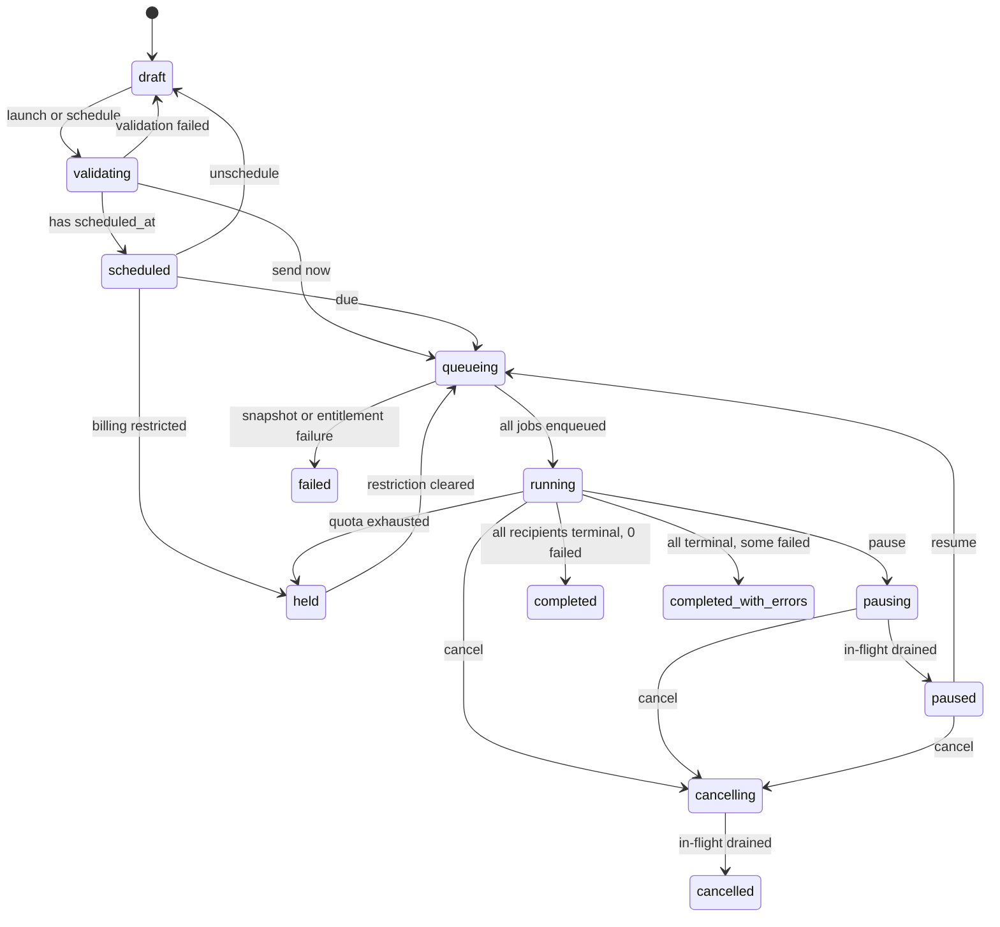
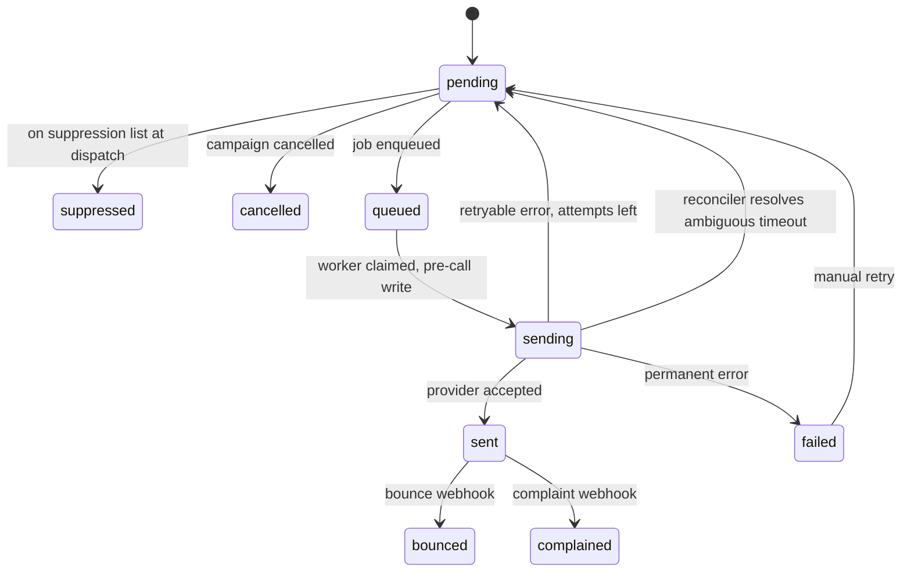
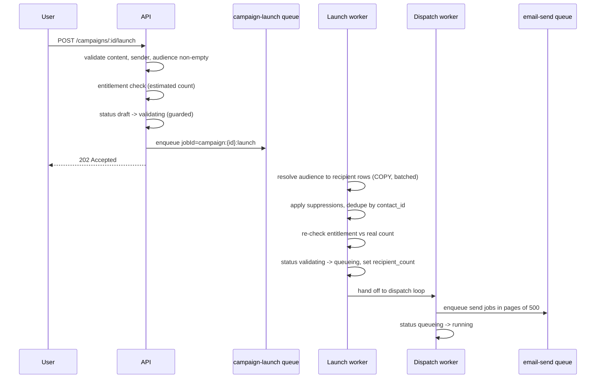

<!-- Campaign engine, queues and workers -->
> **Source of truth note.** This file is extracted from the Technical Design Document v0.1. Where it conflicts with `docs/17-review-findings.md` or `INVARIANTS.md`, those two files win — they contain the corrections from the independent adversarial review. Implement the corrected design, not the original where they differ.

# 11. Campaign engine

Audience is resolved once, at launch, into `campaign_recipients`. Nothing after that point re-queries contacts, lists or segments. That single rule makes pause, resume, cancel, progress and retry trivially correct.

## Extra states your list was missing

Your seven states are not enough. The additions and why each is load-bearing:

| Added state | Why it must exist |
| --- | --- |
| `validating` | Snapshotting 500k recipients takes minutes. Without a state for it, a second launch click double-launches |
| `queueing` | Between snapshot complete and all jobs enqueued, the campaign is neither draft nor fully running. Crash recovery needs to know to resume enqueueing |
| `pausing` | Pause is not instant — in-flight jobs finish. The UI must show "pausing" or users click it repeatedly |
| `cancelling` | Same reason, and cancellation must not report "cancelled" while emails are still going out |
| `completed_with_errors` | "Completed" hides a 30% failure rate. Operators need these separated |
| `held` | Billing restriction or no healthy sender. Distinct from user-initiated `paused`, and auto-resumable |



Transitions are enforced by a single guarded update, never by reading then writing:

```sql
UPDATE campaigns SET status = $new, updated_at = now()
 WHERE id = $id AND workspace_id = $ws AND status = ANY($allowedPrior)
 RETURNING status;
-- 0 rows = illegal transition or someone beat us to it. Return 409, do not retry blindly.
```

## Recipient state machine



`sent`, `failed`, `suppressed`, `cancelled`, `bounced` and `complained` are terminal for dispatch purposes. `bounced` and `complained` are post-delivery annotations; they do not un-meter the send.

## Launch sequence



**Audience resolution** is one `INSERT … SELECT` per source, not a read-then-write loop:

```sql
INSERT INTO campaign_recipients
  (id, workspace_id, campaign_id, contact_id, email, merge_data, message_token, status)
SELECT uuid_generate_v7(), c.workspace_id, $campaign, c.id, c.email,
       jsonb_build_object('first_name', c.first_name, 'last_name', c.last_name)
         || c.attributes,
       gen_random_bytes(16),
       CASE WHEN s.email IS NOT NULL THEN 'suppressed' ELSE 'pending' END
  FROM contacts c
  JOIN contact_list_members m ON m.contact_id = c.id AND m.list_id = ANY($listIds)
  LEFT JOIN suppressions s
         ON s.workspace_id = c.workspace_id AND s.email = c.email AND s.scope = 'workspace'
 WHERE c.workspace_id = $ws
   AND c.deleted_at IS NULL
   AND c.status = 'subscribed'
ON CONFLICT (campaign_id, contact_id) DO NOTHING;
```

`ON CONFLICT DO NOTHING` handles both the same-contact-in-two-lists case and a crashed launch worker resuming. The launch job is fully idempotent: re-running it inserts nothing new and moves on.

Suppressed recipients are inserted rather than skipped. They give an auditable answer to "why didn't Fatima get this?" and a correct `suppressed_count` without a second query.

## Dispatch loop

The dispatcher does not enqueue 2 million jobs at once. It enqueues a bounded window and refills as work completes, so the Redis memory footprint is `O(window)` not `O(recipients)`.

```ts
async function dispatch(campaignId: string) {
  const WINDOW = 5_000, PAGE = 500;
  while (true) {
    const campaign = await repo.getForDispatch(campaignId);
    if (!['queueing', 'running'].includes(campaign.status)) return;   // paused/cancelled: stop

    const inFlight = await sendQueue.countFor(campaignId);
    if (inFlight >= WINDOW) { await sleep(500); continue; }

    const batch = await repo.claimNextRecipients(campaignId, PAGE);   // see SQL below
    if (batch.length === 0) { await maybeComplete(campaignId); return; }

    await sendQueue.addBulk(batch.map(r => ({
      name: 'send',
      data: { recipientId: r.id, campaignId, workspaceId: r.workspaceId },
      opts: { jobId: `send:${r.id}`, attempts: 5,
              backoff: { type: 'exponential', delay: 2_000 } },
    })));

    if (campaign.throttlePerHour) await sleep(throttleDelay(campaign, PAGE));
  }
}
```

```sql
-- claimNextRecipients: atomic claim, safe with N concurrent dispatchers
WITH picked AS (
  SELECT id FROM campaign_recipients
   WHERE campaign_id = $1 AND status = 'pending'
   ORDER BY id
   LIMIT $2
   FOR UPDATE SKIP LOCKED
)
UPDATE campaign_recipients cr
   SET status = 'queued', queued_at = now()
  FROM picked p WHERE cr.id = p.id
RETURNING cr.id, cr.workspace_id, cr.email;
```

`jobId = send:{recipientId}` gives BullMQ-level dedup for free: enqueueing the same recipient twice is a no-op while the job exists.

## Pause, resume, cancel

| Operation | Immediate effect | In-flight jobs | Completion |
| --- | --- | --- | --- |
| Pause | `running → pausing`; dispatcher's next loop exits | Allowed to finish — they are already at the provider | A sweep sets `pausing → paused` once in-flight is zero |
| Resume | `paused → queueing`; dispatcher restarts | n/a | Picks up exactly where it stopped, because `pending` rows are the queue |
| Cancel | `→ cancelling`; dispatcher exits | Allowed to finish | Bulk `UPDATE … SET status='cancelled' WHERE status IN ('pending','queued')`, then `cancelled` |

Workers also check a cheap Redis flag (`campaign:{id}:halt`, TTL 1h) before each batch, so a pause takes effect within one batch rather than one page. The flag is an optimisation; Postgres status is the truth, and a worker that cannot reach Redis falls back to the DB check.

Queued-but-unprocessed jobs for a cancelled campaign are not purged from Redis. The worker sees the recipient is `cancelled` and acks immediately. Purging a queue by filter is expensive and racy; letting jobs no-op is cheap and correct.

## Completion

A campaign is complete when no recipient is in `pending`, `queued` or `sending`. Checking that on every job completion is `O(n²)`; instead the dispatcher checks once when it runs dry, and a scheduled sweep re-checks any `running` campaign with no activity for 10 minutes. Completion is a guarded transition, so a race between the two just returns 0 rows for the loser.

```sql
UPDATE campaigns c
   SET status = CASE WHEN c.failed_count > 0 THEN 'completed_with_errors' ELSE 'completed' END,
       completed_at = now()
 WHERE c.id = $1 AND c.status IN ('running','queueing')
   AND NOT EXISTS (SELECT 1 FROM campaign_recipients r
                    WHERE r.campaign_id = c.id
                      AND r.status IN ('pending','queued','sending'));
```

## Retry

Two layers. **Automatic**: BullMQ retries a job up to 5 times with exponential backoff, but only for errors the adapter classified `retryable`. A permanent error acks the job and writes `failed` immediately — retrying a `content_rejected` five times is pure waste. **Manual**: `POST /campaigns/:id/retry-failed` resets `failed` recipients with retryable error codes back to `pending` and restarts the dispatcher. Permanently failed recipients (invalid address, content rejected) are excluded and reported as such. Retries never re-meter, because `metered` is already true if the send was accepted, and false if it was not.

## Scheduling

The scheduler polls `SELECT id FROM campaigns WHERE status='scheduled' AND scheduled_at <= now() FOR UPDATE SKIP LOCKED LIMIT 100` every 30 seconds. Polling beats BullMQ delayed jobs here because a campaign can be rescheduled or unscheduled, and cancelling a delayed job in Redis is a second source of truth you would have to keep consistent.

Timezone handling: `scheduled_at` is stored as `timestamptz`, computed at schedule time from the user's wall-clock input plus the campaign's timezone. "Send at 9am in the recipient's timezone" is a different feature that needs per-recipient scheduling — it is out of MVP and, when built, becomes a `send_after` column on `campaign_recipients` that the dispatch query filters on.

## The wizard

| Step | Persists | Validation | Gate to advance |
| --- | --- | --- | --- |
| 1 Details | name, type | name required | — |
| 2 Audience | `audience` jsonb | at least one source; live estimated count | count > 0 |
| 3 Content | `template_version_id`, subject | required merge tags resolvable; link check; spam-signal lint | HTML compiles, text alternative exists |
| 4 Sender | pool or sender | `From` domain verified on the chosen provider | verified identity |
| 5 Tracking | `tracking` jsonb | — | — |
| 6 Schedule | `scheduled_at`, throttle | future time; provider capacity sanity check | — |
| 7 Review | — | full validation re-run; entitlement pre-check; seed test send offered | all green |
| 8 Launch | status transition | `campaign:launch` permission | confirm dialog showing recipient count and estimated quota use |

Every step is a `PATCH /campaigns/:id` that saves a draft. There is no wizard state in the frontend beyond the current step index — reloading mid-wizard resumes exactly where you were.

## Clone

Copies name (suffixed), type, audience definition, `template_version_id`, sender, tracking and throttle. Never copies status, recipients, counters, schedule or timestamps. `cloned_from` records the lineage, which is also what makes "duplicate and A/B this" a natural later feature.


---

# 12. Queue and worker architecture

Queues carry work, never state. Every job payload is a set of ids the worker re-reads from Postgres; a job that carries a copy of the data is a job that acts on stale data after a retry.

## Queue catalogue

| Queue | Producer | Concurrency/worker | Timeout | Attempts | Backoff | `jobId` (idempotency) | Retention |
| --- | --- | --- | --- | --- | --- | --- | --- |
| `campaign-launch` | API | 2 | 30 min | 3 | fixed 60s | `campaign:{id}:launch` | done 24h, failed 30d |
| `campaign-dispatch` | launch worker, scheduler | 1 per campaign | 6 h | 3 | fixed 30s | `campaign:{id}:dispatch` | done 1h, failed 7d |
| `email-send` | dispatch worker | 25 | 60 s | 5 | exp 2s, cap 5 min | `send:{recipientId}` | done 1h, failed 7d |
| `email-retry` | send worker | 10 | 60 s | 3 | exp 5 min, cap 6 h | `retry:{recipientId}:{attempt}` | done 1h, failed 7d |
| `provider-webhook` | ingest | 20 | 30 s | 5 | exp 1s | `pwh:{providerId}:{eventId}` | done 6h, failed 30d |
| `billing-webhook` | ingest | 5 | 60 s | 8 | exp 5s, cap 1 h | `bwh:{provider}:{eventId}` | done 30d, **failed never** |
| `billing-task` | API, scheduler | 5 | 5 min | 5 | exp 30s | task-specific | done 7d, failed 90d |
| `contact-import` | API | 2 | 2 h | 2 | fixed 5 min | `import:{importId}` | done 7d, failed 30d |
| `analytics-rollup` | scheduler, webhook worker | 8 | 5 min | 3 | exp 10s | `rollup:{scope}:{bucket}` | done 1h, failed 7d |
| `outbound-webhook` | domain events | 20 | 15 s | 6 | exp 10s, cap 6 h | `owh:{endpointId}:{eventId}` | done 24h, failed 30d |
| `notification` | domain events | 10 | 30 s | 3 | exp 30s | `notif:{key}` | done 24h, failed 7d |
| `maintenance` | scheduler | 2 | 1 h | 2 | fixed 5 min | `maint:{task}:{date}` | done 7d, failed 30d |

Three deliberate choices in that table:

- **`billing-webhook` never discards a failed job.** A dropped billing event is money or entitlement drift. Failed jobs stay forever, page an operator, and are replayable by hand.
- **`email-send` concurrency is 25 per worker**, not 200. Per-sender concurrency is enforced by the rate limiter; a high worker concurrency just means more workers blocked on token acquisition.
- **`campaign-dispatch` is one job per campaign**, long-running, self-refilling. Running three dispatchers for one campaign gains nothing because the claim query already serialises, and it triples the chance of a throttle miscalculation.

## Worker deployment groups

Separate ECS services so one backlog cannot starve another:

| Service | Queues | Scaling signal | Min/max tasks |
| --- | --- | --- | --- |
| `worker-send` | `email-send`, `email-retry` | queue depth per task | 2 / 40 |
| `worker-campaign` | `campaign-launch`, `campaign-dispatch` | active campaign count | 1 / 8 |
| `worker-events` | `provider-webhook`, `analytics-rollup` | queue depth | 2 / 20 |
| `worker-billing` | `billing-webhook`, `billing-task` | queue depth | 2 / 4 |
| `worker-io` | `contact-import`, `outbound-webhook`, `notification`, `maintenance` | queue depth | 1 / 10 |
| `scheduler` | producer only | none | 1 / 1 |

`worker-billing` runs at minimum 2 tasks across two AZs even at zero load. Billing latency is trust.

## Job payload shapes

```ts
type SendJob = {
  recipientId: string; campaignId: string; workspaceId: string;
  attempt?: number;                 // only for retry queue
};

type ProviderWebhookJob = {
  eventRowId: string;               // row in provider_webhook_events
  providerId: string; workspaceId: string;
};

type BillingWebhookJob = {
  eventRowId: string;               // row in payment_webhook_events
  provider: 'stripe' | 'razorpay';
  providerEventId: string;
};

type ImportJob = { importId: string; workspaceId: string; resumeFromRow?: number };

type RollupJob = {
  scope: 'campaign' | 'workspace' | 'provider' | 'contact_engagement';
  refId: string; bucket: string;    // '2026-09-17T14'
};
```

Note what is absent: no email bodies, no contact data, no credentials, no amounts. Every worker re-reads current truth. A job that sat in a queue for an hour during an incident therefore does the *right* thing when it finally runs, not the thing that was right an hour ago.

## Dead letter strategy

BullMQ has no native DLQ, so it is explicit:

```ts
worker.on('failed', async (job, err) => {
  if (job.attemptsMade < job.opts.attempts) return;      // will retry
  await db.insert(deadLetters).values({
    queue: job.queueName, jobId: job.id, payload: job.data,
    error: serialiseError(err), attempts: job.attemptsMade,
    workspaceId: job.data.workspaceId ?? null, failedAt: new Date(),
  });
  metrics.increment('queue.dead_letter', { queue: job.queueName });
  if (CRITICAL_QUEUES.has(job.queueName)) await pager.page({ queue: job.queueName, jobId: job.id });
});
```

```sql
CREATE TABLE dead_letters (
  id           uuid PRIMARY KEY,
  queue        text NOT NULL,
  job_id       text NOT NULL,
  workspace_id uuid,
  payload      jsonb NOT NULL,
  error        jsonb NOT NULL,
  attempts     smallint NOT NULL,
  status       text NOT NULL DEFAULT 'new'
               CHECK (status IN ('new','investigating','replayed','discarded')),
  replayed_at  timestamptz,
  failed_at    timestamptz NOT NULL DEFAULT now()
);
CREATE INDEX ix_dl_queue ON dead_letters (queue, status, failed_at DESC);
```

An internal admin endpoint replays a dead letter by re-enqueueing with the original `jobId`, which means a replay of an already-succeeded job is a no-op. That property is why every queue in the table above has a deterministic `jobId`.

## Graceful shutdown

SIGTERM handling is the difference between a clean deploy and hundreds of ambiguous sends:

```ts
process.on('SIGTERM', async () => {
  logger.info('sigterm: draining');
  await Promise.all(workers.map(w => w.pause(true)));   // stop taking new jobs
  await Promise.all(workers.map(w => w.close()));       // wait for active to finish
  await queueEvents.close();
  await redis.quit();
  await pool.end();
  process.exit(0);
});
```

ECS `stopTimeout` is set to 120 seconds, comfortably above the 60-second `email-send` job timeout, so an in-flight send always completes or times out cleanly rather than being killed mid-HTTP-call. That single setting eliminates most ambiguous-timeout cases.

## Redis capacity and failure

| Concern | Handling |
| --- | --- |
| Memory | `maxmemory-policy noeviction` on the queue instance. **Never `allkeys-lru`** — evicting a job is silent data loss |
| Separation | Two logical uses, one cluster, separate key prefixes and separate connections: `bull:*` and `cache:*`. If cache traffic ever threatens queue latency, split into two ElastiCache groups |
| Failover | Multi-AZ replication group with automatic failover; BullMQ reconnects. Jobs in flight at failover are retried, which is why idempotency is mandatory everywhere |
| Total loss | Queue contents are reconstructible: campaigns resume from `campaign_recipients` status, webhooks replay from the inbox tables, imports resume from `processed_rows`. Recovery is a documented runbook, not a rebuild |

That last row is the real argument for keeping state in Postgres: losing Redis entirely costs a few minutes of throughput, not a single email or payment.


---

# Review amendments — apply on top of everything above

These supersede the baseline where they differ.

## H — queue changes

| Queue | Change |
| --- | --- |
| `email-send` | `lockDuration: 120000`, `maxStalledCount: 0`, provider timeout capped below lock duration, batch size capped at 100 |
| `email-retry` | Merged into `email-send` as delayed jobs; a separate consumer is how the limiter got bypassed (F11) |
| `recipient-sweeper` | **New.** Every 60s: `queued` older than 5 min back to `pending`; `sending` older than 10 min to `delivery_uncertain` |
| `campaign-reconcile` | **New.** Every 60s: force-exit stale transient campaign states; recompute counters against source of truth hourly |
| `event-ingest` | Renamed from provider webhook processing; high concurrency, resolves per-connection, applies the rank lattice |
| `billing-webhook` | No longer re-fetches inline; marks objects dirty in `billing_refetch_queue` |
| `billing-refetch` | **New.** Coalesced, at most one fetch per object per 30s, rate-limited inside Stripe's read budget |
| `billing-reconcile` | **New.** Nightly Stripe comparison with a divergence metric |
| `analytics-rollup` | Hourly pass becomes a genuine recompute over a bounded window, not watermark-incremental |
| scheduler | Drives from `scheduled_jobs` in Postgres; BullMQ repeatables removed entirely |
| limiter | Lives inside the provider adapter call path, fails closed, applies to first attempts and retries alike |

---
