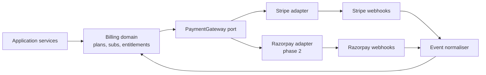
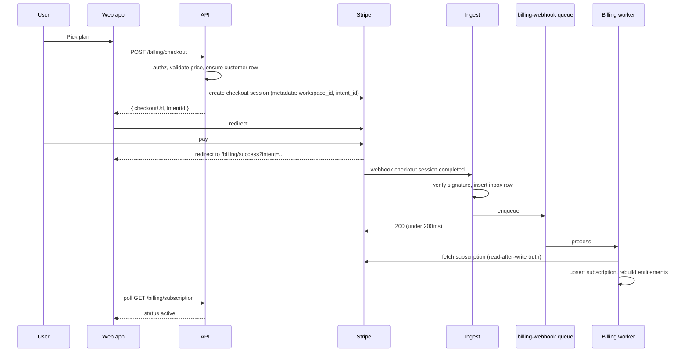
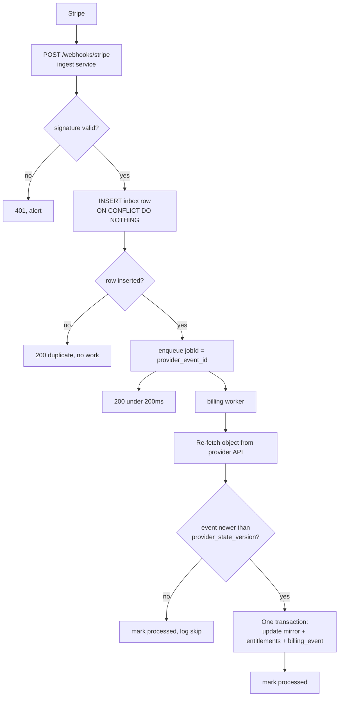
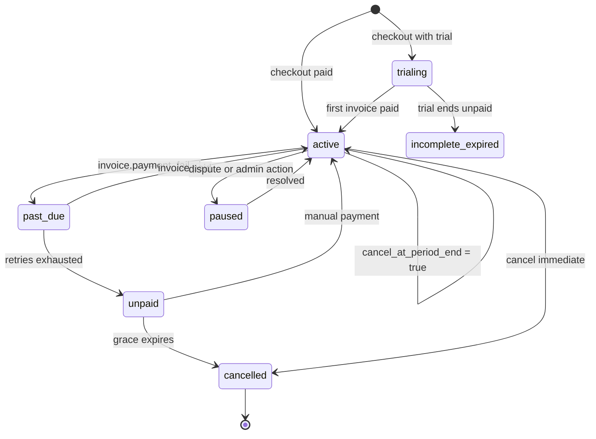
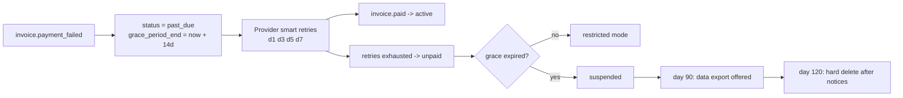
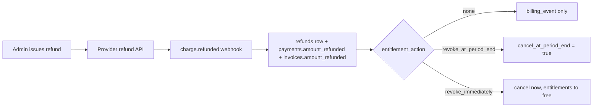
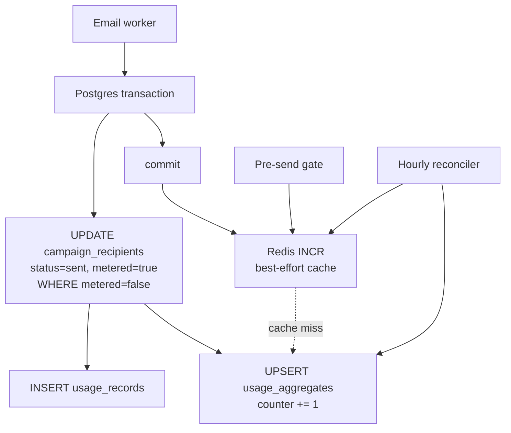

<!-- Billing: provider choice, lifecycle, entitlements and metering -->
> **Source of truth note.** This file is extracted from the Technical Design Document v0.1. Where it conflicts with `docs/17-review-findings.md` or `INVARIANTS.md`, those two files win — they contain the corrections from the independent adversarial review. Implement the corrected design, not the original where they differ.

# 5. Billing, part 1: choosing the payment provider

**Recommendation: Stripe as the primary processor, with Stripe Tax, billing your own entity.** Add Razorpay later only if Indian domestic INR revenue justifies a second integration. Do not use a merchant of record for this product.

This section states a commercial and tax position. It is engineering analysis, not tax or legal advice, and the items flagged at the end need a qualified adviser in your jurisdiction before you take payments.

## The two models

|  | Direct processor (Stripe, Razorpay) | Merchant of record (Paddle, Lemon Squeezy) |
| --- | --- | --- |
| Who is the seller of record | You | The provider |
| Who owes VAT/GST to each country | You, once you cross each threshold | The provider |
| Who handles tax registration and filing | You and your accountant | The provider |
| Typical blended cost | \~2.9% + fixed, plus tax tooling | \~5% + fixed |
| Subscription primitives | Deep: proration, schedules, usage items, pauses | Shallower; scheduled changes are limited |
| Invoice control | Full | Templated, their branding co-present |
| Payment-method breadth | Very wide, region-specific rails | Narrower |
| Dependency risk | Processor churn is survivable | Losing the MoR means losing *all* revenue and the customer-of-record relationship |

## Why not a merchant of record here

The MoR pitch is real: it removes global VAT/GST registration, which is genuinely the ugliest part of selling software worldwide. I would recommend it for a small indie tool. I do not recommend it for this product, for three reasons in order of severity:

1. **Category risk.** MoRs underwrite the sale and therefore police what is sold. Bulk-email sending tooling sits close to the line in acceptable-use terms, because it is adjacent to spam infrastructure in their risk models. A sudden account review is survivable for a side project and fatal for a funded SaaS. Your entire revenue channel would sit on a platform that has a policy reason to be nervous about you.
2. **Billing model fit.** You will want metered overages (emails beyond plan), mid-cycle upgrades with proration, scheduled downgrades at period end, and per-seat items. Stripe models all of these natively. MoRs treat metered and proration as second-class.
3. **Cost at scale.** The \~2 point delta is invisible at $5k MRR and is a full engineer at $200k MRR.

The honest counter-argument: if you sell mostly to consumers and micro-businesses across 40 countries and have no finance function, the MoR fee buys you compliance you cannot otherwise staff. If that is your actual go-to-market, revisit this. **Decision required.**

## Provider-by-provider

| Criterion | Stripe | Razorpay | Paddle | Lemon Squeezy |
| --- | --- | --- | --- | --- |
| UAE entity can onboard | Yes, Stripe operates in the UAE and supports AED | No, India-domiciled entities | Yes | Yes |
| India entity / INR domestic | Stripe India exists but is restrictive; RBI e-mandate rules make card recurring hard | Native; handles e-mandate, UPI Autopay, NACH | Handles as MoR, you avoid the problem | As MoR |
| Recurring subscriptions | Best in class | Good domestically | Good | Adequate |
| Proration and schedules | Native, both directions | Limited | Limited | Limited |
| Usage-based / metered | Native meters | Manual | Limited | Limited |
| Tax calculation | Stripe Tax, you remain liable | You remain liable | They are liable | They are liable |
| Invoices | Full control, hosted + PDF | Yes | Theirs | Theirs |
| Webhooks | Mature, signed, replayable | Signed | Signed | Signed |
| Refunds and partial refunds | Full API | Full API | Via dashboard/API | Yes |
| Disputes | Full lifecycle API and evidence submission | Yes | They absorb | They absorb |
| Dunning / smart retries | Built in, configurable | Basic | Built in | Built in |
| Test/sandbox quality | Excellent, CLI event replay | Adequate | Adequate | Adequate |

Regulatory and product facts above change; verify current capability with each provider during Phase 12 rather than trusting this table at implementation time.

## The recommended architecture

**One primary processor, but an abstracted internal billing domain.** This is the key structural point: your application must never import the Stripe SDK outside `packages/billing/adapters/stripe`.



The port is narrow on purpose:

```ts
export interface PaymentGateway {
  readonly id: 'stripe' | 'razorpay';
  ensureCustomer(input: EnsureCustomerInput): Promise<GatewayCustomer>;
  createCheckout(input: CreateCheckoutInput): Promise<{ url: string; sessionId: string }>;
  createBillingPortalSession(customerRef: string, returnUrl: string): Promise<{ url: string }>;
  getSubscription(subRef: string): Promise<GatewaySubscription>;
  changeSubscription(input: ChangeSubscriptionInput): Promise<GatewaySubscription>;
  cancelSubscription(subRef: string, mode: 'immediate' | 'period_end'): Promise<GatewaySubscription>;
  refund(input: RefundInput): Promise<GatewayRefund>;
  verifyWebhook(rawBody: Buffer, headers: Record<string, string>): Promise<VerifiedEvent>;
  normalise(event: VerifiedEvent): NormalisedBillingEvent[];
}
```

`normalise` is what keeps provider vocabulary out of your domain. Stripe's `customer.subscription.updated` and Razorpay's `subscription.charged` both become your own `SUBSCRIPTION_RENEWED` or `SUBSCRIPTION_UPDATED`. Section 7.

## Multi-currency

Price in USD as the base. Add AED and INR price rows on the same plan, with hand-set local pricing rather than FX conversion — customers expect round local numbers, and FX drift makes automated conversion look broken. Currency is chosen at first checkout and pinned on the subscription; changing it requires a new subscription.

## Where professional advice is required

These are business-liability questions that engineering cannot resolve. Get answers before launch, not after:

- UAE VAT registration threshold, treatment of your SaaS supply, and whether your customers' locations trigger reverse charge.
- Whether B2B customers in the EU/UK/GCC shift the VAT obligation to the buyer, and what evidence of business status you must collect and store (VAT number validation, two pieces of location evidence).
- Indian GST on services supplied to Indian customers, OIDAR rules if you are a non-resident supplier, and the TCS/TDS implications of any Indian payment rail.
- Whether a UAE free-zone versus mainland entity changes any of the above.
- Invoice content requirements per jurisdiction (sequential numbering, tax registration number, reverse-charge wording) and statutory retention periods.

Technically you must build: tax ID capture per customer, a tax rate/amount recorded on every invoice line, and an immutable sequential invoice number per legal entity. That plumbing is in section 6 regardless of which answers your adviser gives.


---

# 7. Billing, part 3: lifecycle

The frontend never decides a payment succeeded. The webhook worker is the only writer of `subscriptions.status`, and it writes under an ordering guard so a stale event cannot overwrite a newer state.

## End-to-end checkout



The success page shows a pending state and polls. It never reads a query parameter and concludes anything.

## `POST /api/v1/billing/checkout`

| Property | Value |
| --- | --- |
| Auth | Session JWT or API key with `billing:write` |
| Authorization | Caller must be `owner` of the workspace. `admin` cannot change billing |
| Idempotency | `Idempotency-Key` header required; 24h window |
| Transaction | Customer row created and committed *before* calling the provider |
| Rate limit | 10/hour per workspace |

```json
POST /api/v1/billing/checkout
X-Workspace-Id: 018f2c11-...
Idempotency-Key: 6f1d9a2e-...

{
  "priceId": "018f3a44-...",
  "quantity": 3,
  "couponCode": "LAUNCH20",
  "successUrl": "https://app.relayd.io/billing/success",
  "cancelUrl": "https://app.relayd.io/billing/plans",
  "taxId": { "type": "ae_trn", "value": "1002..." }
}
```

```json
201 Created
{
  "data": {
    "intentId": "018f5b90-...",
    "checkoutUrl": "https://checkout.stripe.com/c/pay/cs_test_...",
    "expiresAt": "2026-09-17T12:30:00Z"
  }
}
```

Server-side validation before the provider is called:

1. Price exists, `is_active`, belongs to a `is_public` plan (or the caller has an override grant).
2. Requested plan tier is a legal transition from the current one — a workspace with an active paid subscription is routed to `changeSubscription`, not a second checkout.
3. `quantity` for per-seat prices equals current member count; you cannot buy fewer seats than you use.
4. Currency matches the customer's pinned currency if one exists.
5. Downgrade-blocking check: if the target plan's limits are below current usage, return `422 plan_downgrade_blocked` with the specific offending features. This is a **hard block at checkout**, and it is much kinder than accepting money and then restricting the account.

Errors: `403 forbidden`, `404 price_not_found`, `409 subscription_exists`, `422 plan_downgrade_blocked`, `429 rate_limited`, `502 provider_unavailable`.

## Webhook pipeline



Four guarantees, each from a different mechanism:

| Guarantee | Mechanism |
| --- | --- |
| No duplicate processing | `uq_pwe (provider, provider_event_id)` plus BullMQ `jobId` set to the same value |
| No out-of-order regression | Re-fetch the object from the provider, compare its version/timestamp to `provider_state_version`, discard stale |
| No lost events | Inbox row is committed before the 200 is returned; a nightly reconciliation job lists provider objects changed in the last 48h and repairs drift |
| No partial writes | Mirror update, entitlement rebuild and `billing_events` insert are one Postgres transaction |

**Why re-fetch instead of trusting the payload.** Webhook delivery is at-least-once and unordered. `subscription.updated` (plan A) can arrive after `subscription.updated` (plan B). Re-fetching makes the handler *convergent*: whatever order events arrive, you always write the provider's current truth. The event becomes a trigger, not data. This one decision eliminates most of the ordering problems in section 19.

## Normalised event map

| Stripe event | Our event | Effect |
| --- | --- | --- |
| `checkout.session.completed` | `CHECKOUT_COMPLETED` | Link customer, create subscription row, rebuild entitlements |
| `customer.subscription.created` | `SUBSCRIPTION_CREATED` | Upsert; idempotent with the above |
| `customer.subscription.updated` | `SUBSCRIPTION_UPDATED` | Re-fetch, apply plan/status/period, rebuild entitlements |
| `customer.subscription.deleted` | `SUBSCRIPTION_ENDED` | Status `cancelled`, downgrade entitlements to free at `ended_at` |
| `customer.subscription.paused/resumed` | `SUBSCRIPTION_PAUSED/RESUMED` | Suspend or restore send entitlement only |
| `invoice.created` / `finalized` | `INVOICE_CREATED` | Mirror invoice and lines |
| `invoice.paid` | `INVOICE_PAID` | Mark paid, clear `past_due`, reset usage window if period rolled |
| `invoice.payment_failed` | `INVOICE_PAYMENT_FAILED` | Enter dunning, set `grace_period_end` |
| `payment_intent.succeeded/failed` | `PAYMENT_*` | Mirror payment row |
| `charge.refunded` | `REFUND_CREATED` | Mirror refund, apply `entitlement_action` |
| `charge.dispute.created` | `DISPUTE_OPENED` | Suspend sending immediately, alert ops |

Unmapped events are stored and marked `ignored`. Never 400 an unknown event type — the provider will retry it forever.

## Subscription state machine



## Plan changes

| Direction | When it applies | Proration | Entitlements | Why |
| --- | --- | --- | --- | --- |
| Upgrade | Immediately | Yes, charge the prorated difference now | Raised immediately on webhook confirmation | The customer paid for more capacity and expects it now |
| Downgrade | End of current period | None; no credit issued | Unchanged until period end, then lowered | Avoids refund complexity and mid-campaign capability loss |
| Same-tier interval change (monthly→annual) | Immediately | Yes, credit unused monthly | Unchanged | It is an upgrade in commitment |
| Seat increase | Immediately | Prorated | Immediate |  |
| Seat decrease | End of period | None | Immediate *soft* reduction: cannot invite more, existing seats keep working |  |

Downgrade is implemented as `pending_plan_id` + `pending_effective_at` on the subscription, plus a provider-side subscription schedule. The scheduler double-checks daily: if `pending_effective_at` has passed and the provider has not applied it, it reconciles.

**Downgrade pre-check is mandatory.** Before accepting a downgrade, compute current usage against the target plan's limits and return the specific conflicts:

```json
422 Unprocessable Entity
{
  "error": {
    "code": "plan_downgrade_blocked",
    "message": "Current usage exceeds the target plan",
    "details": [
      { "feature": "audience.contacts", "current": 48210, "targetLimit": 10000 },
      { "feature": "team.seats", "current": 7, "targetLimit": 3 }
    ]
  }
}
```

The UI then tells the user exactly what to delete or archive. Never accept the downgrade and silently break the workspace.

## Failed payments and dunning



What each state does to the product:

| Capability | `past_due` (day 0–14) | `unpaid` / restricted (15–30) | `suspended` (31–90) | After 90 days |
| --- | --- | --- | --- | --- |
| Login and dashboard | Yes | Yes | Yes, billing pages only | Yes |
| Contacts and lists | Full | Read + delete only | Read-only | Export available |
| Launch new campaign | Yes, with banner | **No** | No | No |
| Scheduled campaigns | Run | **Held, not cancelled** | Held | Held |
| Running campaign | **Completes** | Completes | n/a | n/a |
| Provider connections | Active | Active | Retained, not used | Retained |
| Analytics | Full | Full | Read-only | Read-only |
| API | Full | Reads + writes except send | Reads only | Reads only |
| Outbound webhooks | Active | Active | Paused | Paused |
| Data deletion | Never | Never | Never | Only after 3 notices and an export window |

Two deliberate choices. **A running campaign always completes.** Killing a send mid-flight because a card expired is a worse outcome for everyone including you — the emails are already partially out and the recipient experience is broken. **Scheduled campaigns are held, not cancelled**, and resume automatically on payment.

Notifications: day 0 (email + in-app banner), day 3, day 7, day 13 (final warning before restriction), day 14, day 30 (suspension notice), day 60, day 85 (deletion warning). All to workspace owners plus the billing contact, all recorded in `billing_events`.

## Cancellation

|  | Cancel at period end (default) | Cancel immediately |
| --- | --- | --- |
| `status` | stays `active`, `cancel_at_period_end = true` | `cancelled` at once |
| Entitlements | unchanged until `current_period_end` | drop to free plan now |
| Refund | none | none by default; issue separately if you choose |
| Reversible | yes, one click, until the period ends | no; requires a new checkout |
| Who gets it | self-serve UI | support action, or a dispute/abuse response |

**The worked example.** Pro subscription renews 30 October. The user cancels on 15 October choosing period-end. From 15–30 October nothing changes: full Pro limits, campaigns run, scheduled sends fire, invoices already paid stay paid. The UI shows "Pro until 30 October" and a Resume button. At 00:00 on 30 October the provider emits `customer.subscription.deleted`; the worker sets `status = cancelled`, `ended_at`, and rebuilds entitlements from the free plan. From that moment: contacts above the free limit become read-only but are not deleted, scheduled campaigns beyond the free allowance move to `held`, API send endpoints return `402`, analytics history remains visible for the free plan's retention window.

If the user had chosen immediate cancellation on 15 October, all of that happens on 15 October and the remaining 15 days are not refunded unless you grant one.

## Refunds



Rules: partial refunds default to `entitlement_action = 'none'` (goodwill credit, service continues); full refunds of the current period default to `revoke_at_period_end`; refunds issued as part of an abuse takedown use `revoke_immediately`. **Usage already consumed is never clawed back**, and the refund does not reset the usage counter — the emails were sent.

Every refund writes an `audit_logs` row with the acting admin, plus a `billing_events` row with before/after. The invoice moves to `paid` with `amount_refunded > 0`, never back to `open`.

## Tax and invoicing

Use **Stripe Tax** for calculation, with these responsibilities staying yours:

| Concern | Who does it |
| --- | --- |
| Rate determination per customer location | Stripe Tax |
| Customer location evidence | You must collect and store it: billing address plus payment-method country, both persisted on `billing_customers` |
| Tax ID capture and format validation | Stripe validates format; you store `tax_id_type` and `tax_id_value` |
| Reverse-charge determination for B2B | Stripe applies it when a valid tax ID is present; **you remain liable for whether that was correct** |
| Registration in each jurisdiction | You and your adviser. Stripe Tax monitors thresholds, it does not register for you |
| Filing and remittance | You, or Stripe's filing partner |
| Invoice storage and retention | Mirror the PDF into your own S3 bucket on `invoice.paid`. Do not depend on the provider's hosted URL living forever |

If your jurisdiction requires gapless sequential invoice numbering under your own entity, generate `local_number` from a Postgres sequence at the moment the invoice is marked paid, and never reuse or skip a number. That is what `uq_inv_local_number` protects.

Re-flagging the section 5 point: the questions of *whether* you must register for VAT/GST anywhere, how to treat UAE and Indian customers, and what your invoices must legally contain are for a qualified tax adviser. Build the plumbing; let them set the values.


---

# 8. Entitlements and usage metering

**One billable send = one `campaign_recipients` row transitioning to `sent` for the first time.** Retries, provider failovers, bounces and complaints never add to the count. This is the definition the whole system is built around.

## Why that definition

| Candidate definition | Rejected because |
| --- | --- |
| Provider API call | A retry after a 500 would double-bill a customer for one email |
| Delivered event | We do not control delivery; a customer with poor deliverability would pay less for the same work, and delivered events arrive hours late |
| Recipient enqueued | A cancelled campaign would bill for emails never sent |
| Recipient row created | Same problem, worse |
| **First successful provider acceptance per recipient** | **Correct: one email intended, one email handed over, one charge** |

Edge cases resolved explicitly:

| Case | Billable? |
| --- | --- |
| Send accepted, then hard-bounces | Yes. We did the work; the bounce is the customer's list quality |
| Send fails at provider, retried, succeeds | Once |
| Recipient suppressed before send | No. Never accepted, never counted |
| Campaign cancelled with 40% sent | 40% counted |
| Provider accepts but worker crashes before commit | Reconciled, then counted once (below) |
| Same contact in two lists in one campaign | Once — `uq_cr_campaign_contact` makes it structurally one row |
| A/B test variants to the same contact | Once per recipient row; an A/B test creates one row per contact |
| Test/preview send to a seed address | No. Tracked under a separate non-billable metric |
| Refund issued | Usage is not reversed |

## Architecture: Redis for the hot path, Postgres for the truth

Neither alone works. Live `COUNT(*)` is too slow at 10M rows and gets called on every send. Redis alone loses data on failover and cannot be audited.



The authoritative counter is a Postgres row updated **in the same transaction** that flips `metered`. Redis is a read cache for the enforcement gate plus a cheap pre-flight, never the source of truth.

```sql
CREATE TABLE usage_aggregates (
  workspace_id    uuid NOT NULL,
  feature_key     text NOT NULL REFERENCES features(key),
  period_start    timestamptz NOT NULL,
  period_end      timestamptz NOT NULL,
  subscription_id uuid,
  used            bigint NOT NULL DEFAULT 0,
  included        bigint,
  overage         bigint NOT NULL DEFAULT 0,
  reported_to_provider_at timestamptz,
  updated_at      timestamptz NOT NULL DEFAULT now(),
  PRIMARY KEY (workspace_id, feature_key, period_start)
);
CREATE INDEX ix_ua_period ON usage_aggregates (period_end) WHERE reported_to_provider_at IS NULL;

-- Append-only evidence. Partitioned monthly, retained 24 months.
CREATE TABLE usage_records (
  id            uuid NOT NULL,
  workspace_id  uuid NOT NULL,
  feature_key   text NOT NULL,
  quantity      integer NOT NULL DEFAULT 1,
  idempotency_key text NOT NULL,     -- 'send:' || campaign_recipient_id
  campaign_id   uuid,
  resource_id   uuid,
  period_start  timestamptz NOT NULL,
  occurred_at   timestamptz NOT NULL DEFAULT now()
) PARTITION BY RANGE (occurred_at);
CREATE UNIQUE INDEX uq_ur_idem_2026_09 ON usage_records_2026_09 (workspace_id, feature_key, idempotency_key);
```

The metering transaction, written exactly once per recipient:

```sql
BEGIN;
  UPDATE campaign_recipients
     SET status = 'sent', metered = true, sent_at = now(),
         provider_message_id = $2, sender_account_id = $3, updated_at = now()
   WHERE id = $1 AND metered = false
   RETURNING workspace_id, campaign_id;
  -- 0 rows = already metered by a concurrent/duplicate job. Roll back, ack the job, done.

  INSERT INTO usage_records (id, workspace_id, feature_key, quantity,
                             idempotency_key, campaign_id, period_start, occurred_at)
  VALUES ($4, $5, 'campaigns.monthly_emails', 1, 'send:' || $1, $6, $7, now())
  ON CONFLICT DO NOTHING;

  INSERT INTO usage_aggregates (workspace_id, feature_key, period_start, period_end, used)
  VALUES ($5, 'campaigns.monthly_emails', $7, $8, 1)
  ON CONFLICT (workspace_id, feature_key, period_start)
  DO UPDATE SET used = usage_aggregates.used + 1, updated_at = now();
COMMIT;
```

Two independent idempotency guards: the `metered = false` predicate and the `usage_records` unique index. Either alone would be sufficient; both together mean a bug in one does not cost money.

**The crash-after-accept case.** The worker calls the provider, the provider returns a message id, the worker dies before committing. On retry the recipient is still `pending`, so the worker would send again. Mitigation, in order: (1) write `status='sending'` with the attempt number *before* the provider call, so a retry sees `sending` and first queries the provider's API for a message matching the recipient's tracking token; (2) if the provider supports client-supplied idempotency (SES `MessageDeduplicationId`-style headers, or a custom `X-Relayd-Recipient` header we always set), use it to detect the prior acceptance; (3) if neither resolves it, prefer a duplicate send over a lost send for transactional-style traffic and prefer a lost send for bulk campaigns — configurable per workspace, default "do not resend", flagged in the campaign report. This is the one place where perfect exactly-once is impossible and you must choose a bias. **Decision required: default bias.**

## Contention at high volume

A single `usage_aggregates` row updated 2,000 times/second becomes a hot row. Two mitigations, applied in order of scale:

1. **Batch at the worker.** Workers process sends in micro-batches of 50–200; one aggregate update per batch, not per email. This alone takes contention down by two orders of magnitude.
2. **Sharded counters** past \~500 sends/sec/workspace: `usage_aggregates_shards (workspace_id, feature_key, period_start, shard smallint)` with `shard = hash(worker_id) % 16`, summed on read and folded into the parent row hourly.

## Enforcement: the entitlement gate

Two functions, used everywhere, no plan names in application code:

```ts
interface EntitlementService {
  can(workspaceId: string, action: Action): Promise<Decision>;
  checkUsage(workspaceId: string, feature: FeatureKey, requested?: number): Promise<UsageDecision>;
  consume(tx: Tx, workspaceId: string, feature: FeatureKey, qty: number, idem: string): Promise<void>;
  invalidate(workspaceId: string): Promise<void>;
}

type Decision =
  | { allowed: true }
  | { allowed: false; code: EntitlementDenialCode; feature: FeatureKey;
      limit?: number; current?: number; upgradeTo?: string };

type EntitlementDenialCode =
  | 'feature_not_in_plan' | 'limit_reached' | 'subscription_past_due'
  | 'subscription_suspended' | 'workspace_suspended';
```

Actions map to feature keys and an optional usage check in a single static table:

```ts
const ACTION_MAP: Record<Action, { feature: FeatureKey; usage?: FeatureKey; requiresActiveBilling: boolean }> = {
  CREATE_CAMPAIGN:   { feature: 'campaigns.enabled',  usage: 'campaigns.monthly_count', requiresActiveBilling: false },
  LAUNCH_CAMPAIGN:   { feature: 'campaigns.enabled',  usage: 'campaigns.monthly_emails', requiresActiveBilling: true },
  IMPORT_CONTACTS:   { feature: 'audience.contacts',  usage: 'audience.contacts',        requiresActiveBilling: false },
  INVITE_MEMBER:     { feature: 'team.seats',         usage: 'team.seats',               requiresActiveBilling: false },
  CONNECT_PROVIDER:  { feature: 'delivery.providers', usage: 'delivery.providers',       requiresActiveBilling: false },
  CREATE_AUTOMATION: { feature: 'automations.enabled',usage: 'automations.count',        requiresActiveBilling: true },
  CALL_API:          { feature: 'api.enabled',        usage: 'api.monthly_calls',        requiresActiveBilling: false },
};
```

Adding a plan means inserting rows. Adding a feature means one `features` row plus one `ACTION_MAP` entry. Nothing branches on plan code anywhere in the codebase — and an ESLint rule forbids the string literals `'free' | 'growth' | 'scale' | 'agency'` outside `packages/billing/plans`.

## Where the gate is called

| Point | Check | Failure behaviour |
| --- | --- | --- |
| `POST /campaigns/:id/launch` | `LAUNCH_CAMPAIGN` with `requested = recipientCount` | `402` with the shortfall; campaign stays `draft` |
| Campaign-launch worker, after snapshot | Re-check against the real recipient count | If insufficient and overage not allowed, campaign → `failed` with a clear reason, zero emails sent |
| Email-send worker, per batch | Cheap Redis read of remaining quota | If exhausted mid-campaign: campaign → `paused` with `reason = 'quota_exhausted'`, owner notified, resumable after upgrade |
| Contact import worker | `IMPORT_CONTACTS` before and during | Stop at the limit, report how many were skipped |
| Invite member | `INVITE_MEMBER` | `402` |
| API middleware | `CALL_API` | `429` with `X-RateLimit-*` headers |

Checking twice — at launch and again in the worker — is deliberate. The launch check gives a good error message; the worker check is the one that actually protects revenue, because the recipient count is only exact after the snapshot.

## Overage

When `plan_features.overage_allowed`, sending past the included quota does not stop. It accrues into `usage_aggregates.overage`, and the scheduler reports it to the provider's metered subscription item daily. A hard ceiling (`overage_hard_cap`, default 3× included) exists so a runaway automation cannot generate a $40,000 invoice; hitting it pauses sending and pages the customer. The free plan never has overage.

## Period boundaries and plan changes mid-period

Usage periods follow the **subscription period**, not the calendar month. On `invoice.paid` with a new period, the worker creates the next `usage_aggregates` rows and resets the Redis keys with a TTL past `period_end`.

On an upgrade mid-period: the `used` counter carries over unchanged, `included` is raised to the new plan's limit, no reset. The customer paid a prorated amount for more headroom in the *same* period, so resetting to zero would give away a free period. On a scheduled downgrade: nothing happens until the period rolls.

## Reconciliation

Hourly, the scheduler runs three checks and alerts on any mismatch above tolerance:

1. `usage_aggregates.used` versus `COUNT(*) FROM usage_records` for the period — must be exact.
2. `COUNT(*) FROM campaign_recipients WHERE metered` for the period versus the same — must be exact.
3. Redis counters versus Postgres — repaired silently; Redis always loses.

Any discrepancy in (1) or (2) is a `P1` alert, because it means money is being computed from a number that does not match its evidence.
