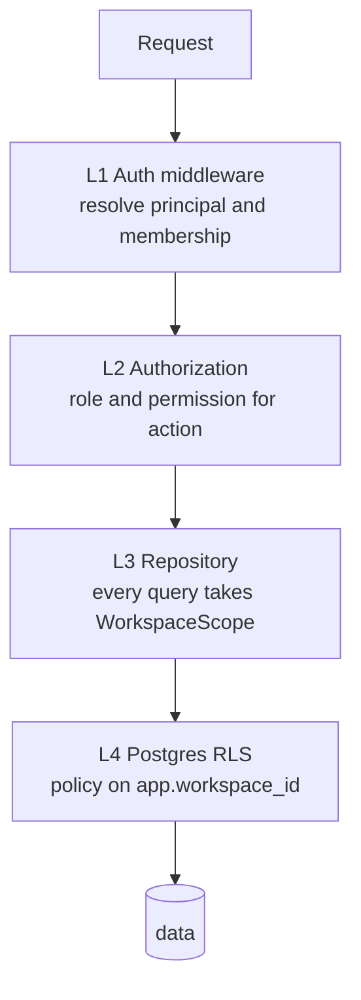
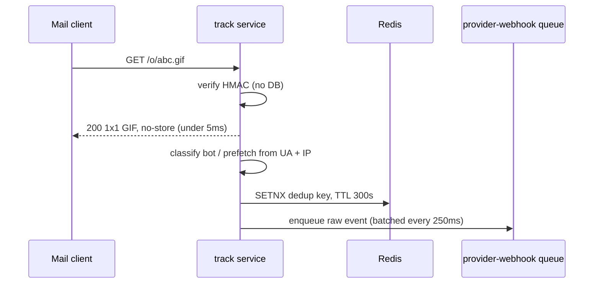
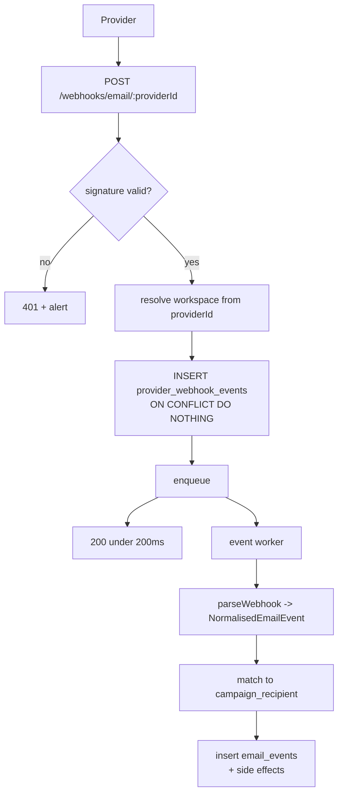

<!-- Multi-tenancy, security, tracking and inbound webhooks -->
> **Source of truth note.** This file is extracted from the Technical Design Document v0.1. Where it conflicts with `docs/17-review-findings.md` or `INVARIANTS.md`, those two files win — they contain the corrections from the independent adversarial review. Implement the corrected design, not the original where they differ.

# 15. Multi-tenancy and security

Four independent layers must all fail before Workspace A reads Workspace B's data. Two of them are compile-time, which is what makes this maintainable as the team grows.

## The four layers



**L1 context.** The workspace header or path param is resolved against `workspace_members` on every request. The result is a frozen `RequestContext` in `AsyncLocalStorage`. A request with no resolvable membership gets `404`, not `403` — never confirm a workspace exists to a non-member.

**L2 authorization.** A static permission matrix, checked by a decorator on every route:

| Permission | owner | admin | editor | viewer |
| --- | --- | --- | --- | --- |
| `workspace:read` | yes | yes | yes | yes |
| `workspace:update` | yes | yes | no | no |
| `workspace:delete` | yes | no | no | no |
| `member:invite`, `member:remove` | yes | yes | no | no |
| `contact:read` | yes | yes | yes | yes |
| `contact:write`, `contact:import` | yes | yes | yes | no |
| `contact:export` | yes | yes | no | no |
| `template:write` | yes | yes | yes | no |
| `campaign:write` | yes | yes | yes | no |
| `campaign:launch` | yes | yes | no | no |
| `provider:read` | yes | yes | yes | yes |
| `provider:write` | yes | yes | no | no |
| `billing:read` | yes | yes | no | no |
| `billing:write` | yes | no | no | no |
| `apikey:write` | yes | yes | no | no |
| `audit:read` | yes | yes | no | no |

API keys carry a scope list that is intersected with the role of a notional service principal. A key can never exceed the permissions of the role that minted it, and `billing:write` is never grantable to an API key.

**L3 repository, enforced by the type system.** This is the layer that actually prevents the bug, because it makes the unsafe version impossible to write by accident:

```ts
export type WorkspaceScope = { readonly workspaceId: string; readonly brand: 'WorkspaceScope' };

// The only constructor, callable solely from the auth middleware.
export function scopeFrom(ctx: RequestContext): WorkspaceScope { return null as never; }

export class ContactRepository {
  // Every method takes the scope. There is no overload without it.
  async findById(scope: WorkspaceScope, id: string): Promise<Contact | null> {
    const [row] = await this.db.select().from(contacts)
      .where(and(eq(contacts.id, id), eq(contacts.workspaceId, scope.workspaceId)))
      .limit(1);
    return row ?? null;
  }
}
```

Backed by two mechanical checks: an ESLint rule banning `db.select()` outside `packages/db/repositories`, and a CI test that reflects over every repository method and fails if the first parameter is not `WorkspaceScope`.

**L4 Postgres RLS as backstop.** Enable from day 1, because retrofitting means auditing every query you have ever written:

```sql
ALTER TABLE contacts ENABLE ROW LEVEL SECURITY;
ALTER TABLE contacts FORCE ROW LEVEL SECURITY;
CREATE POLICY contacts_tenant ON contacts
  USING (workspace_id = current_setting('app.workspace_id', true)::uuid);

-- Set per transaction by the pool wrapper:
BEGIN; SET LOCAL app.workspace_id = '018f...'; /* queries */ COMMIT;
```

Three operational caveats, all real:

- `SET LOCAL` requires a transaction. Wrap every request's database work in one, which you want anyway.
- With RDS Proxy or PgBouncer in transaction pooling mode, `SET LOCAL` is correctly scoped. A bare `SET` would leak across pooled connections, so ban it in review.
- Workers and the scheduler run cross-tenant and connect as a role with `BYPASSRLS`. Their safety comes from L3, not L4.

## Tenant isolation testing

A dedicated suite, run in CI, that must never be skipped:

1. **Matrix test.** Create workspaces A and B with full fixtures. For every endpoint, authenticate as A and attempt to access B's resource id. Assert `404`. Generated from the route table, so a new endpoint without a test fails the build.
2. **Repository reflection test.** Every exported repository method's first parameter is `WorkspaceScope`.
3. **RLS test.** With `app.workspace_id` set to A, a raw select on contacts returns only A's rows.
4. **Cross-tenant FK test.** Adding B's contact to A's list fails.
5. **Queue test.** A job carrying B's workspace id cannot mutate A's rows.
6. **Fuzz test.** 10,000 random uuids substituted into path params; every response is `404` or `400`, never `200`.

## Authentication

| Element | Choice |
| --- | --- |
| Password hashing | argon2id, m=64MB t=3 p=4 |
| Access token | JWT, 15 min, RS256, `kid` for rotation, claims `sub`, `sid`, `wsIds`, `ver` |
| Refresh token | 32 random bytes, hashed in `sessions`, 30 days, rotated on every use |
| Rotation theft detection | Reuse of a consumed token revokes the whole `family_id` and notifies the user |
| Token transport | Refresh in HttpOnly Secure SameSite=Lax cookie; access token in memory only, never localStorage |
| CSRF | Double-submit token on all cookie-authenticated state-changing routes. SameSite alone is not enough for the refresh endpoint |
| MFA | TOTP, required for owners on paid workspaces; recovery codes hashed |
| API keys | Prefixed random 32 bytes, argon2id hashed, prefix indexed for lookup, shown once |
| Session invalidation | `ver` claim compared against a Redis per-user version, bumped on password, role or MFA change, so a 15-minute token window is not a 15-minute privilege window |

## Threat by threat

| Threat | Control |
| --- | --- |
| SQL injection | Drizzle parameterises everything; the segment compiler emits only parameterised predicates from a validated AST; raw SQL is lint-banned outside two audited files |
| XSS in the app | React escaping; CSP with nonces, no unsafe-inline; no raw HTML injection outside the sandboxed preview |
| XSS via email template | Template HTML sanitised server-side against a tag and attribute allowlist before `html_compiled` is stored. Previews render in a sandboxed iframe on a separate origin, never on the app origin, or a malicious template steals sessions |
| CSV formula injection | On export, any cell starting with an equals, plus, minus, at, tab or CR is prefixed with an apostrophe. On import such values are stored as-is but flagged, never evaluated |
| XLSX upload | Streaming reader in a worker with a 512 MB memory cap and 5-minute timeout; zip-bomb guard on uncompressed-size ratio; external entities and formula evaluation disabled; file type verified by magic bytes, not extension |
| SSRF | Three vectors: outbound webhook URLs, custom SMTP host, template image URLs. All pass one validator that resolves DNS, rejects private, link-local and metadata ranges, re-checks after redirects, pins the resolved IP for the connection to defeat DNS rebinding, and caps redirects at 3 |
| Open redirect | The click endpoint resolves the URL from `tracked_links` by index. No URL is ever taken from the request |
| Tracking abuse | HMAC tokens, per-IP rate limits on the pixel and click routes, no enumeration surface |
| Webhook replay | Signature plus 5-minute timestamp tolerance plus provider event id uniqueness |
| Webhook forgery | Raw body preserved for verification. Mount the raw body parser on webhook routes before the JSON parser, or signatures silently break |
| Credential theft | Provider secrets in Secrets Manager. The API task role can write secrets but not read them; only the worker role reads. A database dump contains no usable credentials |
| Mass assignment | Strict Zod schemas. Unknown keys are a 400, not silently dropped |
| IDOR | The four layers above |
| Rate limiting | Redis sliding window: 100 req/min per user, 1000/min per API key scaled by plan, 10/min per IP on auth, 5/hour on password reset, 20/sec per IP on tracking |
| Enumeration | Login, password reset and invite acceptance return identical responses and timing whether or not the account exists |
| CORS | Strict origin allowlist with credentials for the app; the public API uses bearer tokens with no credentialed CORS |
| Dependency risk | Audit in CI, Dependabot, committed lockfile, frozen lockfile in builds |
| Secrets in logs | Pino redaction paths for authorization, password, apiKey, secret, token and card fields, plus a CI grep for secret patterns |

## Anti-abuse: the section that keeps the business alive

A tool that sends bulk email will be signed up for by spammers within weeks. Undetected, your customers' providers suspend them, your processor sees disputes, and your link domain's reputation collapses. Treat this as a launch requirement, not a Phase 16 nicety.

| Control | Mechanism |
| --- | --- |
| Signup friction | Email verification before any send; disposable-domain blocklist; no sending until a sender identity is verified |
| New-workspace ramp | First 7 days capped at 500 emails/day regardless of plan, lifted automatically on clean metrics or manually on request |
| Consent attestation | Every import records a declared consent source; every launch re-confirms it. Stored, timestamped, attributed to a user |
| Complaint monitoring | Workspace complaint rate above 0.1% triggers review; above 0.3% auto-pauses sending. Hard bounce rate above 5% forces list hygiene |
| Content scanning | Launch-time lint for phishing signals: credential-harvest language, brand impersonation in the From name, URL shorteners, mismatched link text and href, executable attachment types |
| Link reputation | Tracked link domains checked against a reputation feed; known-bad domains block the launch |
| Velocity anomalies | A workspace importing 500k contacts and launching within an hour of signup is held for human review |
| Shared signals | Addresses that complained in any workspace go on a global block list applied everywhere |
| Response ladder | Warn, then require review before launch, then pause sending, then suspend, then terminate with data export |

Every enforcement action writes to `audit_logs`, and the ops console for reviewing flagged workspaces ships with the first external customers.

## Infrastructure security

- Private subnets for everything except the load balancer. RDS and ElastiCache have no public route and accept only from the app security group.
- TLS 1.2 or higher everywhere, including to RDS with full verification and to ElastiCache with in-transit encryption.
- Encryption at rest on RDS, ElastiCache, S3 with a customer-managed KMS key, and EBS. Separate KMS keys for data and for the tracking HMAC.
- Five least-privilege task roles: api, track, ingest, worker, scheduler.
- No SSH. Access is ECS Exec, audited, disabled in production except break-glass.
- WAF on the load balancer with managed rule sets plus a rate rule on auth routes.
- GuardDuty, CloudTrail to a locked bucket, Config rules for public buckets and unencrypted volumes.

## Compliance posture

GDPR-shaped obligations apply the moment you have one EU contact, which you will on day one. Build per-contact data export, deletion on request with documented backup propagation within 35 days, a records-of-processing document, a DPA template, and sub-processor disclosure. EU data residency is a Phase 3 sales requirement, not MVP, but do not make a second region impossible: never hardcode a region outside config.


---

# 13. Tracking and inbound webhooks

An open is evidence that an image was fetched. It is not evidence that a human read the email. The product must present it that way, or it teaches customers to make decisions on a number that is wrong by 30–60% depending on their audience's mail clients.

## Token design

```
GET /o/:token.gif     open pixel
GET /c/:token         click redirect
GET /u/:token         one-click unsubscribe (also List-Unsubscribe-Post)
```

The token is not an id. It is an HMAC-carrying opaque blob:

```ts
// payload: 16B message_token || 4B linkIndex || 1B kind
// token   = base64url( payload || HMAC-SHA256(payload, key)[0..9] )
function mint(messageToken: Buffer, kind: Kind, linkIndex = 0): string {
  const p = Buffer.concat([messageToken, u32(linkIndex), Buffer.from([kind])]);
  const mac = hmac(TRACKING_KEY, p).subarray(0, 10);
  return base64url(Buffer.concat([p, mac]));
}
```

Why this shape rather than a UUID lookup:

- **Unguessable.** Forging a token to fake engagement requires the HMAC key. A sequential or UUID token can be scanned.
- **Verifiable without a DB hit.** The track service validates the MAC in microseconds and rejects garbage before touching Postgres. That is what lets a single small service absorb scanner traffic.
- **No PII in the URL.** The token reveals nothing about the recipient, the campaign or the workspace to anyone who sees it in a browser history, a referrer header or a corporate proxy log.
- **Key rotation** is supported by a 1-byte key id prefix; old keys stay valid for 13 months, matching the longest realistic engagement tail.

## Request handling



The response is returned **before** any work. A click redirect is the same shape: verify, resolve the URL from a Redis-cached `tracked_links` row, `302` immediately, enqueue asynchronously. Target p99 under 20 ms for both, because a slow pixel makes the customer's email look broken and a slow redirect makes it look untrustworthy.

Click URL resolution never trusts the token to carry a URL. The token carries `linkIndex`; the service looks up `tracked_links` for that campaign. This closes the open-redirect hole completely — there is no way to make `/c/...` point anywhere except a URL the campaign author saved.

## Bot and prefetch classification

Stored as two booleans, never as deletion. Raw events are always kept; the UI filters.

| Signal | Classified as | Notes |
| --- | --- | --- |
| Open within 2 s of `sent_at` | `is_prefetch` | Nothing human is that fast |
| UA matches Apple's Mail Privacy Protection proxy pattern | `is_prefetch` | Apple prefetches every image for Mail users who enabled protection |
| Source IP in a known scanner range (Proofpoint, Mimecast, Barracuda, cloud egress) | `is_bot` | Maintained list, refreshed monthly |
| Open with no subsequent click, from a datacentre ASN | `is_bot` | Weak signal, used only in aggregate |
| More than 3 distinct link clicks within 1 s | `is_bot` | Link scanner walking the email |
| `HEAD` request, or `Range` request for the pixel | `is_bot` |  |
| Click before any open | neither | Common and legitimate; image blocking is normal |

Dedup: an open from the same `(token, ip_hash, ua_hash)` within 5 minutes is one event. Repeat opens outside that window are kept as `opens_total` but do not increment `opens_unique`.

## What the UI is allowed to say

This is a product decision with engineering consequences, so it belongs here:

| Metric | Label shown | Notes surfaced |
| --- | --- | --- |
| `clicks_unique / delivered` | **Click rate** — the headline engagement metric | Reliable |
| `opens_unique_nonbot / delivered` | "Opens (filtered)", secondary | Tooltip: privacy features inflate and suppress this; treat as directional |
| `opens_unique / delivered` | Shown only in a detail view | Labelled "including automated fetches" |
| Device and client mix | Shown with a caveat | Apple MPP reports a generic client and a proxy IP; a large "unknown/proxy" slice is expected, and its size is displayed honestly |
| Geography | From `geo_country` | Explicitly labelled approximate; MPP routes through proxies in other countries |

Make open tracking a per-campaign toggle that defaults to **on**, and unsubscribe-link injection mandatory. Some customers in regulated or privacy-sensitive markets will want opens off entirely; supporting that is cheap and is a sales asset.

## Privacy posture

- IPs are hashed with a rotating daily salt (`ip_hash`), never stored raw. Country is derived before hashing and stored separately.
- `List-Unsubscribe` and `List-Unsubscribe-Post: List-Unsubscribe=One-Click` headers on every campaign email, non-negotiable, not a setting. Bulk senders are required to support one-click unsubscribe by the major mailbox providers.
- Unsubscribe via `GET /u/:token` shows a confirmation page; via `POST` (one-click) it acts immediately and returns 200.
- Event retention is per plan (see section 14); expired raw events are archived to S3 and deleted from Postgres.

## Inbound provider webhooks

Same shape as billing webhooks, different endpoint and different worker pool:



```ts
interface NormalisedEmailEvent {
  providerEventId: string;
  type: 'delivered' | 'bounce' | 'complaint' | 'deferred' | 'open' | 'click' | 'unsubscribe' | 'reject';
  bounceClass?: 'hard' | 'soft' | 'block';
  providerMessageId?: string;
  recipientEmail: string;
  occurredAt: Date;
  raw: unknown;
}
```

**Matching an event to a recipient**, in order of reliability:

1. `provider_message_id` — exact, used whenever the provider returns and echoes one.
2. Our `X-Relayd-Recipient` custom header, echoed by providers that support custom headers.
3. `(workspace_id, email, occurred_at window)` against recent recipients — last resort, ambiguous when the same address got two campaigns the same hour. Ambiguous matches are recorded as workspace-level events with no `campaign_recipient_id` rather than guessed.

Side effects are applied in the same transaction as the event insert:

| Event | Side effects |
| --- | --- |
| `delivered` | `campaign_stats.delivered++`; `provider_stats.delivered++` |
| `bounce` hard | recipient → `bounced`; contact → `bounced`; **insert suppression** (`hard_bounce`); sender health check |
| `bounce` soft | counter only; 3 soft bounces in 30 days for one contact promotes to suppression |
| `complaint` | recipient → `complained`; contact → `unsubscribed`; **insert suppression**; sender health `-40`; workspace complaint-rate check |
| `deferred` | counter only |
| `unsubscribe` | contact → `unsubscribed`; insert suppression |
| `reject` | recipient → `failed`, permanent |

Suppression inserts use `ON CONFLICT DO NOTHING` on `uq_suppression`, so a duplicate bounce webhook is harmless. Every side effect is idempotent by construction, which is the only sane way to handle at-least-once delivery from six different providers with six different retry policies.
