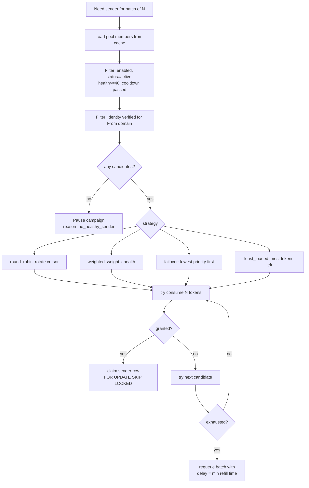
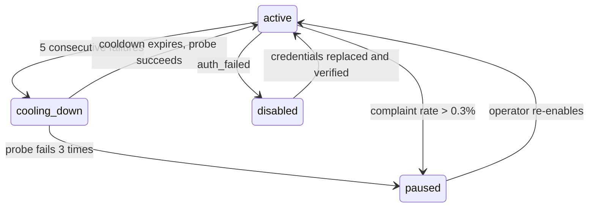

<!-- Email provider abstraction, sending pools and routing -->
> **Source of truth note.** This file is extracted from the Technical Design Document v0.1. Where it conflicts with `docs/17-review-findings.md` or `INVARIANTS.md`, those two files win — they contain the corrections from the independent adversarial review. Implement the corrected design, not the original where they differ.

# 9. Email provider abstraction

Your draft interface is close but misses four things that will force provider-specific branches back into business logic: typed error classification, batch sending, capability declaration, and credential lifecycle.

## The improved port

```ts
export type ProviderType = 'ses' | 'sendgrid' | 'mailgun' | 'brevo' | 'smtp' | 'google';

export interface ProviderCapabilities {
  readonly maxBatchSize: number;            // 1 for SMTP, 50 for SES bulk, 1000 for SendGrid
  readonly supportsWebhooks: boolean;
  readonly supportsTracking: boolean;       // provider-side open/click; we prefer our own
  readonly supportsCustomHeaders: boolean;
  readonly supportsScheduling: boolean;
  readonly supportsSuppressionSync: boolean;
  readonly returnsMessageId: boolean;
  readonly reportsQuota: boolean;
  readonly maxRecipientsPerMessage: number;
  readonly maxMessageBytes: number;
}

export interface OutboundMessage {
  readonly recipientId: string;             // campaign_recipient_id — our correlation key
  readonly to: { email: string; name?: string };
  readonly from: { email: string; name: string };
  readonly replyTo?: string;
  readonly subject: string;
  readonly html: string;
  readonly text: string;
  readonly headers: Readonly<Record<string, string>>;  // includes List-Unsubscribe, X-Relayd-Recipient
  readonly listUnsubscribe: { mailto?: string; url: string; oneClick: boolean };
  readonly attachments?: ReadonlyArray<{ filename: string; contentType: string; contentBase64: string }>;
}

export type SendOutcome =
  | { ok: true;  recipientId: string; providerMessageId: string | null; acceptedAt: Date }
  | { ok: false; recipientId: string; error: ProviderError };

export interface ProviderError {
  readonly kind: ErrorKind;
  readonly retryable: boolean;
  readonly retryAfterMs?: number;
  readonly providerCode?: string;
  readonly message: string;
  readonly affects: 'message' | 'sender' | 'connection';  // blast radius
}

export type ErrorKind =
  | 'auth_failed'          // connection: disable, notify owner
  | 'rate_limited'         // sender: back off, retry
  | 'quota_exceeded'       // sender: cool down until reset
  | 'invalid_recipient'    // message: permanent, suppress
  | 'invalid_sender'       // connection: identity unverified
  | 'content_rejected'     // message: permanent, do not retry
  | 'message_too_large'    // message: permanent
  | 'provider_unavailable' // connection: retry, consider failover
  | 'timeout'              // message: retry, ambiguous — may have been accepted
  | 'unknown';

export interface EmailProviderAdapter {
  readonly type: ProviderType;
  readonly capabilities: ProviderCapabilities;

  verifyConnection(creds: ProviderCredentials): Promise<VerificationResult>;
  getQuota(creds: ProviderCredentials): Promise<QuotaSnapshot | null>;
  listVerifiedIdentities(creds: ProviderCredentials): Promise<SenderIdentitySnapshot[]>;

  send(creds: ProviderCredentials, message: OutboundMessage): Promise<SendOutcome>;
  sendBatch(creds: ProviderCredentials, messages: readonly OutboundMessage[]): Promise<SendOutcome[]>;

  verifyWebhookSignature(raw: Buffer, headers: Record<string, string>, secret: string): boolean;
  parseWebhook(raw: Buffer, headers: Record<string, string>): NormalisedEmailEvent[];

  configureWebhook?(creds: ProviderCredentials, callbackUrl: string): Promise<{ secret: string }>;
  syncSuppressions?(creds: ProviderCredentials, since: Date): Promise<SuppressionEntry[]>;
}
```

What changed from your draft and why it matters:

| Change | Why business logic needs it |
| --- | --- |
| `ProviderError.kind` + `affects` | The router decides *what* to disable — one message, one sender, or the whole connection — without knowing which provider it was talking to. This is the single most important addition |
| `sendBatch` with `capabilities.maxBatchSize` | Sending 100k emails one HTTP call at a time is 10× slower and costs more. The worker batches to whatever the adapter declares |
| `recipientId` on both input and outcome | Batch APIs return results in arbitrary order; correlation must be explicit |
| `capabilities` object | Lets the campaign UI show "this provider cannot schedule" instead of failing at send time |
| `retryAfterMs` | Honours `Retry-After` from the provider instead of guessing |
| Credentials passed per call, never held | Adapters are stateless and cacheable; credential rotation takes effect on the next send |

## Error classification drives behaviour

This table is the contract every adapter must implement. It is also the thing to unit-test hardest, because it is where provider quirks actually live.

| `kind` | Recipient status | Sender action | Connection action | Suppression |
| --- | --- | --- | --- | --- |
| `auth_failed` | back to `pending` | pause all senders | `status = error`, notify owner | no |
| `rate_limited` | `pending`, requeue with delay | consume backoff budget | none | no |
| `quota_exceeded` | `pending`, requeue after reset | `cooling_down` until reset | none | no |
| `invalid_recipient` | `failed` permanent | none | none | **yes**, `invalid` |
| `invalid_sender` | `pending` | `disabled` | identity re-verify | no |
| `content_rejected` | `failed` permanent | none | none | no; flag campaign |
| `provider_unavailable` | `pending`, retry | `health_score -= 20` | `degraded` after 3 | no |
| `timeout` | `sending`, **ambiguous** | `health_score -= 10` | none | no |

`timeout` is the dangerous one. It leaves the recipient in `sending`, which the reconciler picks up after 10 minutes and resolves against the provider before deciding to resend. Section 8.

## Per-provider notes

| Provider | Auth | Batch | Webhooks | Sharp edges |
| --- | --- | --- | --- | --- |
| Amazon SES | IAM keys or assumed role | `SendBulkEmail`, up to 50 destinations | SNS → HTTPS, needs subscription confirmation | Sandbox mode by default; per-region identities; account-level sending quota is the real ceiling |
| SendGrid | API key | v3 mail/send, up to 1000 personalizations | Signed event webhook | Its own click tracking rewrites URLs and will conflict with ours — disable one |
| Mailgun | API key, domain-scoped | Batch via recipient-variables | Signed webhooks per event type | EU vs US API base URL is a common misconfiguration |
| Brevo | API key | Up to 99 `messageVersions` | Webhooks configured per account | Lower default throughput than the others |
| SMTP | Host/port/user/pass | None; 1 per message, connection pooled | **None** — no delivery feedback at all | No bounce data except SMTP-time rejections. Must be surfaced in the UI as reduced tracking |
| Google Workspace | OAuth2 refresh token | None | None | \~2,000 recipients/day; restricted scopes require annual security assessment; not a bulk channel |

SMTP deserves a product decision: without webhooks you cannot know about asynchronous bounces, so a workspace sending campaigns purely over SMTP will accumulate bad addresses invisibly. Mitigation is to require a bounce mailbox (VERP return-path + IMAP polling) for SMTP senders above a volume threshold, or to label SMTP as best-effort in the UI. **Decision required.**

## Credential handling

```ts
export type ProviderCredentials =
  | { type: 'ses'; accessKeyId: string; secretAccessKey: string; region: string }
  | { type: 'sendgrid' | 'brevo'; apiKey: string }
  | { type: 'mailgun'; apiKey: string; domain: string; region: 'us' | 'eu' }
  | { type: 'smtp'; host: string; port: number; secure: boolean; user: string; pass: string }
  | { type: 'google'; refreshToken: string; clientId: string; clientSecret: string };
```

The flow: the API layer receives credentials over TLS, validates them by calling `verifyConnection`, writes them straight to Secrets Manager under `relayd/{env}/workspace/{workspaceId}/provider/{providerId}`, and stores only the ARN. The API task role can write secrets but **cannot read them**; only the worker task role can read. A compromised API container therefore cannot exfiltrate customer sending credentials. Credentials are cached in worker memory for 5 minutes keyed by `credential_version`, and bumping that column forces a refresh.

## Adapter file layout

```
packages/email-providers/
  src/
    port.ts                 # interfaces above, no deps
    registry.ts             # ProviderType -> adapter, the only switch in the package
    errors.ts               # ProviderError factories, shared classification helpers
    adapters/
      ses/{index,send,webhook,errors,quota}.ts
      sendgrid/…  mailgun/…  brevo/…  smtp/…  google/…
    testing/
      fake-provider.ts      # deterministic, scriptable failures for tests
      contract.spec.ts      # every adapter runs the same 40-case suite
```

`contract.spec.ts` is the mechanism that keeps the abstraction honest: one shared test suite that every adapter must pass, covering each `ErrorKind`, batch correlation, webhook signature rejection, and idempotent parse of a duplicate event.


---

# 10. Sending pools and routing

Routing exists to respect limits across several of the customer's own accounts and to fail over when one is unhealthy. It must never be capable of exceeding what any single provider permits.

## The guardrail, stated as a constraint

Before the algorithm, the rule it is built to enforce:

- Every sender's effective rate is `min(operator-set limit, provider-reported limit)`. The provider's number always wins, and it is refreshed by a scheduled job.
- A pool's total capacity is the **sum of independently legitimate accounts**, not a way to exceed one account's quota.
- Two senders that resolve to the same underlying provider account share one rate-limit bucket keyed by `provider_connection_id`, not by `sender_account_id`. This is the specific mechanism that prevents "add the same SES account three times to triple the quota".
- Rejections classified `quota_exceeded` cool the sender down; they never trigger an immediate reroute to a sibling sender for the same message within the same minute. Retry after the reset.
- The UI never suggests adding more senders as a remedy for hitting a provider's limit. It surfaces the provider's own guidance.

These are enforced in code, not documented as policy. A pool with senders that share a `provider_connection_id` shows a warning and merges their buckets.

## Rate limiting: Redis token buckets

One bucket per `(scope, id, window)`, as a Lua script so check-and-consume is atomic:

```
KEY   rl:{connectionId}:hour       capacity = provider hourly quota
KEY   rl:{connectionId}:day        capacity = provider daily quota
KEY   rl:{senderAccountId}:hour    capacity = min(operator, provider share)
KEY   rl:{senderAccountId}:day
KEY   conc:{senderAccountId}       simple counter, concurrency_limit
```

```lua
-- consume(n) across N buckets atomically: all or nothing
local now = tonumber(ARGV[1]); local n = tonumber(ARGV[2])
for i = 1, #KEYS do
  local cap = tonumber(ARGV[2 + i * 2 - 1])
  local refill = tonumber(ARGV[2 + i * 2])
  local b = redis.call('HMGET', KEYS[i], 'tokens', 'ts')
  local tokens = tonumber(b[1]) or cap
  local ts = tonumber(b[2]) or now
  tokens = math.min(cap, tokens + (now - ts) * refill)
  if tokens < n then return {0, i, tokens} end   -- reject, name the blocking bucket
  redis.call('HSET', KEYS[i], 'tokens_pending', tokens - n)
end
for i = 1, #KEYS do
  local p = redis.call('HGET', KEYS[i], 'tokens_pending')
  redis.call('HSET', KEYS[i], 'tokens', p, 'ts', now)
  redis.call('HDEL', KEYS[i], 'tokens_pending')
  redis.call('EXPIRE', KEYS[i], 172800)
end
return {1}
```

Redis losing its state fails **closed at the sender level**: on a Redis miss the bucket refills to capacity, which could burst. To prevent that, buckets are seeded from `provider_stats` for the current window on cache miss, so a Redis flush costs at most one window's accounting, not an unlimited burst.

## Sender health

`health_score` starts at 100 and moves on evidence, recomputed every 5 minutes by the analytics worker over a 6-hour window:

| Signal | Effect |
| --- | --- |
| Accepted send | `+0.1`, capped at 100 |
| `provider_unavailable` or `timeout` | `-10` |
| `auth_failed` | → 0, sender `disabled` |
| Hard bounce rate over 5% in window | `-25` |
| Complaint rate over 0.1% in window | `-40` and alert; over 0.3% → `paused`, owner notified |
| 5 consecutive failures | `cooling_down` for 15 min, exponential to 4 hours |

Below 40 a sender is skipped by the router but stays selectable manually. Below 20 it is `paused`. The complaint thresholds mirror what the major providers themselves enforce; a workspace crossing them repeatedly triggers the abuse review in section 15.

## Routing algorithm



```ts
async function selectSender(
  poolId: string, batchSize: number, fromDomain: string, ctx: Ctx
): Promise<SenderLease | Deferral> {
  const candidates = (await poolCache.members(poolId))
    .filter(m => m.enabled)
    .filter(m => m.status === 'active')
    .filter(m => m.healthScore >= MIN_HEALTH)
    .filter(m => !m.cooldownUntil || m.cooldownUntil < ctx.now)
    .filter(m => m.verifiedDomains.includes(fromDomain));

  if (candidates.length === 0) return { kind: 'no_sender' };

  const ordered = order(candidates, pool.strategy, ctx);
  let soonestRefill = Infinity;

  for (const c of ordered) {
    // One atomic multi-bucket consume. Connection buckets are shared, so two
    // senders on the same provider account cannot exceed that account's quota.
    const grant = await rateLimiter.consume(
      [conn(c.providerConnectionId, 'hour'), conn(c.providerConnectionId, 'day'),
       snd(c.senderAccountId, 'hour'),        snd(c.senderAccountId, 'day')],
      batchSize
    );
    if (!grant.ok) { soonestRefill = Math.min(soonestRefill, grant.refillMs); continue; }

    const slot = await concurrency.acquire(c.senderAccountId, c.concurrencyLimit);
    if (!slot) { await rateLimiter.refund(grant, batchSize); continue; }

    return { kind: 'lease', senderAccountId: c.senderAccountId,
             providerConnectionId: c.providerConnectionId, grant, slot };
  }
  return { kind: 'defer', retryAfterMs: Math.min(soonestRefill, 60_000) };
}

function order(cs: Candidate[], strategy: Strategy, ctx: Ctx): Candidate[] {
  switch (strategy) {
    case 'round_robin':  return rotate(cs, ctx.cursor++ % cs.length);
    case 'failover':     return [...cs].sort((a, b) => a.priority - b.priority);
    case 'least_loaded': return [...cs].sort((a, b) => b.tokensRemaining - a.tokensRemaining);
    case 'weighted':
    default:             return weightedShuffle(cs, c => c.weight * (c.healthScore / 100));
  }
}
```

The `FOR UPDATE SKIP LOCKED` claim referenced in the diagram applies when a sender has `concurrency_limit = 1` (typical for SMTP). For higher-concurrency senders the Redis concurrency counter is sufficient and cheaper. This is a case where I deliberately use the weaker mechanism: a brief over-admission by one is harmless; a Postgres row lock held across an HTTP call to a provider is not.

## Failure escalation



A campaign whose pool has zero healthy senders does not fail. It moves to `paused` with `pause_reason = 'no_healthy_sender'`, notifies the owner, and a scheduled probe resumes it automatically when a sender recovers. Failing a half-sent campaign is almost always the wrong call.

## Adaptive routing: not in MVP

Weighted-by-health is adaptive enough. True adaptive routing (shifting weight toward the provider with the best recent delivery rate) needs delivery feedback you will not have reliably until webhooks have been running for months, and it makes debugging "why did this go via SendGrid" much harder. Revisit after 6 months of `provider_stats`. Build the `strategy` column now; leave the value out of the enum until then.
