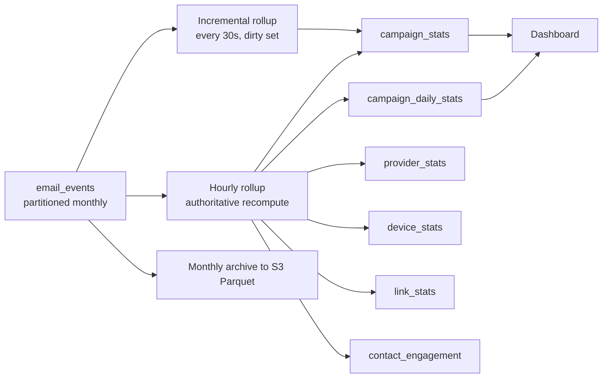

<!-- Analytics pipeline -->
> **Source of truth note.** This file is extracted from the Technical Design Document v0.1. Where it conflicts with `docs/17-review-findings.md` or `INVARIANTS.md`, those two files win — they contain the corrections from the independent adversarial review. Implement the corrected design, not the original where they differ.

# 14. Analytics pipeline

No dashboard query ever touches `email_events`. Every number on every screen comes from a pre-aggregated table with a primary-key lookup or a small range scan.

## Flow



Two rollup paths on purpose. The **incremental** path gives near-real-time counters during a send: the event worker adds `campaign_id` to a Redis dirty set, and a 30-second job recomputes only those campaigns with counters, not full scans. The **hourly** path recomputes the same numbers from the events table authoritatively and overwrites. Incremental can drift; hourly repairs it. This is much simpler than trying to make incremental perfectly exact, and the drift window is at most an hour on a number nobody bills from.

```sql
-- hourly, per dirty campaign
INSERT INTO campaign_stats (campaign_id, workspace_id, delivered, bounced_hard, complained,
                            opens_total, opens_unique, opens_unique_nonbot,
                            clicks_total, clicks_unique, unsubscribed, computed_at)
SELECT $1, $2,
  count(*) FILTER (WHERE event_type = 'delivered'),
  count(*) FILTER (WHERE event_type = 'bounce' AND bounce_class = 'hard'),
  count(*) FILTER (WHERE event_type = 'complaint'),
  count(*) FILTER (WHERE event_type = 'open'),
  count(DISTINCT campaign_recipient_id) FILTER (WHERE event_type = 'open'),
  count(DISTINCT campaign_recipient_id) FILTER (WHERE event_type = 'open'
                                                 AND NOT is_bot AND NOT is_prefetch),
  count(*) FILTER (WHERE event_type = 'click'),
  count(DISTINCT campaign_recipient_id) FILTER (WHERE event_type = 'click'),
  count(*) FILTER (WHERE event_type = 'unsubscribe'),
  now()
  FROM email_events
 WHERE campaign_id = $1 AND occurred_at >= $3
ON CONFLICT (campaign_id) DO UPDATE SET …;
```

`sent`, `failed` and `recipients` on `campaign_stats` come from `campaign_recipients`, not from events, because they are dispatch facts rather than feedback facts.

## Partitioning and retention

| Table | Partition | Created | Hot | Then |
| --- | --- | --- | --- | --- |
| `email_events` | monthly by `occurred_at` | 3 months ahead by scheduler | 3 months | `pg_dump` partition → S3 Parquet, `DETACH` + `DROP` |
| `usage_records` | monthly | 3 ahead | 24 months | archive; never drop within a statutory window |
| `audit_logs` | monthly | 3 ahead | 12 months | archive, retain 7 years in S3 Glacier |
| `campaign_recipients` | hash by `campaign_id` (32) if adopted | at migration | forever while campaign exists | rows dropped with campaign |
| `campaign_daily_stats` | none | — | forever | tiny |

Retention of *queryable* event history is a plan feature (`analytics.retention_days`): 30 days free, 90 starter, 365 growth, 730 agency. Enforcement is a filter on the query, not a delete — the underlying partition is dropped on the global schedule, so a plan upgrade restores access to history that still exists.

**Decision required:** whether to promise restoration of archived events on upgrade. My recommendation is no — say "analytics history from your upgrade date forward", because restoring Parquet into Postgres on demand is an operational burden you do not need in year one.

## Why not a separate analytics store

The tempting move is ClickHouse or Timescale on day 1. Do not. Postgres with monthly partitions and pre-aggregation handles this comfortably to roughly 500M events, which at 3 events per email is around 150M emails. You will know long before that point whether the product is working. Adding a second datastore now costs you a replication pipeline, a second operational skill set, and consistency bugs between two sources of truth — in exchange for scale you do not have.

The migration path when you do need it: `email_events` is already append-only and partitioned, so it streams to ClickHouse cleanly, and the rollup tables keep the same shape. Design so that migration is possible; do not pay for it now.

## Query patterns the schema must serve

| Screen | Query | Cost |
| --- | --- | --- |
| Campaign card list | `campaign_stats` by `workspace_id` | index scan, \~20 rows |
| Campaign detail header | `campaign_stats` PK lookup | 1 row |
| Campaign timeline chart | `campaign_daily_stats` for one campaign | ≤ 90 rows |
| Link performance table | `link_stats` join `tracked_links` by campaign | ≤ 50 rows |
| Device breakdown | `device_stats` by campaign | ≤ 30 rows |
| Workspace overview | `campaign_daily_stats` grouped by day | ≤ 400 rows |
| Provider health | `provider_stats` last 30 days | ≤ 200 rows |
| **Activity log / event feed** | `email_events` by `(workspace_id, occurred_at DESC)` limit 50 | the only raw-event read, keyset-paginated, never `OFFSET` |
| Contact activity timeline | `email_events` by `campaign_recipient_id` | bounded by that contact's sends |

The event feed is the one place raw events are exposed. It is keyset-paginated (`WHERE occurred_at < $cursor ORDER BY occurred_at DESC LIMIT 50`) and capped at the plan's retention window, so it touches at most two partitions.

## Materialised views

Not in MVP. `REFRESH MATERIALIZED VIEW CONCURRENTLY` needs a unique index, takes a full recompute, and gives you a second staleness model to reason about on top of the rollups. The rollup tables *are* the materialisation, and they update incrementally, which a matview cannot. Revisit only for a specific slow cross-campaign query that rollups genuinely cannot serve.

## Exports

Anything above 10,000 rows is asynchronous: a `maintenance` job streams a CSV to S3 and emails a presigned link valid 24 hours. Synchronous CSV downloads are the classic way to take down an API container with one click on a 2M-row contact list.
