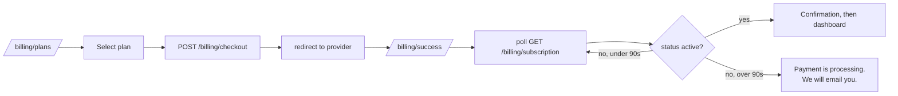

<!-- Frontend architecture -->
> **Source of truth note.** This file is extracted from the Technical Design Document v0.1. Where it conflicts with `docs/17-review-findings.md` or `INVARIANTS.md`, those two files win — they contain the corrections from the independent adversarial review. Implement the corrected design, not the original where they differ.

# 17. Frontend architecture

TanStack Query is the state layer. There is no Redux, no Zustand store of server data, and no global cache you maintain by hand. Server state lives in the query cache; the only client state is UI state, and there is very little of it.

## Stack, with the reasoning

| Concern | Choice | Note |
| --- | --- | --- |
| Build | Vite + React 18 + TypeScript | As proposed |
| Routing | React Router 6 with data routers | Loaders prefetch into the Query cache, so navigation is not a spinner |
| Server state | TanStack Query v5 | Also handles polling for campaign progress and post-checkout subscription state |
| Forms | React Hook Form + Zod resolver | The **same Zod schemas as the backend**, shared via `packages/validation`. Client and server validation cannot diverge |
| Styling | Tailwind + a small set of primitives | Do not adopt a heavy component kit; you will fight it on the campaign builder |
| Charts | Recharts | Adequate. Keep chart components dumb and fed by mapped data |
| Tables | TanStack Table, virtualised | A 50,000-contact list must not mount 50,000 rows |
| Email editor | MJML + a code view in MVP; visual builder later | Building a drag-and-drop editor is a quarter of work. Ship templates and a code editor first |

Sharing Zod schemas between client and server is the single highest-leverage decision in this list. It is why `packages/validation` sits at layer 2 in section 2.

## Directory structure

```
apps/web/src/
  app/                    router, providers, error boundary, query client
  features/               vertical slices — the primary organising unit
    auth/ contacts/ lists/ segments/ imports/ suppressions/
    providers/ senders/ pools/ templates/ campaigns/ analytics/
    team/ api-keys/ billing/
      api.ts              typed fetchers, generated client wrappers
      queries.ts          useQuery/useMutation hooks, query keys
      components/         feature-local components
      routes/             route components
      schemas.ts          re-exports from packages/validation
  components/ui/          Button, Input, Table, Dialog, Toast — presentational only
  components/layout/      AppShell, Sidebar, WorkspaceSwitcher, BillingBanner
  lib/                    apiClient, queryClient, auth, formatters, permissions
  hooks/                  useWorkspace, usePermission, useEntitlement, usePolling
```

Feature slices rather than layer folders. `components/`, `hooks/`, `utils/` at the top level become dumping grounds by month three; a slice you can delete in one directory stays understandable.

## Query key and cache conventions

```ts
export const keys = {
  contacts: {
    all:    (ws: string) => ['ws', ws, 'contacts'] as const,
    list:   (ws: string, f: ContactFilters) => [...keys.contacts.all(ws), 'list', f] as const,
    detail: (ws: string, id: string) => [...keys.contacts.all(ws), 'detail', id] as const,
  },
  campaigns: {
    progress: (ws: string, id: string) => ['ws', ws, 'campaigns', id, 'progress'] as const,
  },
  billing: {
    subscription: (ws: string) => ['ws', ws, 'billing', 'subscription'] as const,
    usage:        (ws: string) => ['ws', ws, 'billing', 'usage'] as const,
  },
} as const;
```

**Every key is prefixed with the workspace id.** Switching workspaces therefore cannot show stale data from the previous one, and `queryClient.removeQueries(['ws', oldId])` on switch is a one-liner. This is the frontend half of tenant isolation, and it is the part people forget.

Polling: campaign progress at 3s while `running`, stopped on terminal status. Subscription state at 2s for up to 90 seconds after returning from checkout, then a manual refresh prompt.

## Route map

| Route | Guard | Notes |
| --- | --- | --- |
| `/login`, `/register`, `/forgot-password`, `/invite/:token` | public |  |
| `/onboarding` | authed, no workspace | Create first workspace |
| `/dashboard` | member | Overview cards, recent campaigns, usage widget |
| `/audience/contacts`, `/lists`, `/tags`, `/segments`, `/imports`, `/suppressions` | `contact:read` |  |
| `/providers`, `/senders`, `/pools` | `provider:read` |  |
| `/templates`, `/templates/:id/edit` | `template:write` to edit |  |
| `/campaigns`, `/campaigns/new`, `/campaigns/:id/edit` | `campaign:write` | Wizard at `/campaigns/:id/edit/:step` so steps are linkable and refresh-safe |
| `/campaigns/:id` , `/campaigns/:id/analytics`, `/campaigns/:id/recipients` | `campaign:read` |  |
| `/analytics` | member |  |
| `/settings/profile`, `/workspace`, `/team`, `/api`, `/webhooks`, `/audit` | varies |  |
| `/billing`, `/plans`, `/checkout`, `/success`, `/cancelled`, `/invoices`, `/payment-method` | `billing:read`, mutations need `billing:write` |  |

## Permission and entitlement in the UI

Two different concepts, two different components. Conflating them produces confusing UX.

```tsx
// Permission: this user's role cannot do it. Hide or disable with an explanation.
<Can permission="campaign:launch" fallback={<Tooltip text="Ask an admin to launch" />}>
  <Button onClick={launch}>Send campaign</Button>
</Can>

// Entitlement: the plan cannot do it. Show it, and sell the upgrade.
<Entitled feature="automations.enabled" fallback={<UpgradePrompt feature="automations" />}>
  <AutomationBuilder />
</Entitled>
```

The rule: **a missing permission hides the action; a missing entitlement shows it with an upgrade path.** Never hide a feature the customer could buy — that is lost revenue and a confusing product.

Both are advisory only. The server re-checks everything, and the client never receives data it is not entitled to.

## Billing UI



The success page has three states — processing, confirmed, still pending — and **never** a fourth that reads the URL and celebrates. If the webhook is slow, the honest message is "your payment is processing", not a false success followed by a dashboard that still says Free.

Billing components:

| Component | Behaviour |
| --- | --- |
| `PlanCards` | Current plan marked, upgrades say Upgrade, lower tiers say Downgrade, unavailable tiers explain why |
| `CurrentPlanCard` | Plan, price, renewal date, and a cancellation notice if `cancelAtPeriodEnd` |
| `UsageMeters` | One bar per limited feature; amber at 80%, red at 100%; overage shown as a separate segment |
| `InvoiceTable` | Date, number, amount, status, PDF link; paginated |
| `PaymentMethodCard` | Brand, last4, expiry; expiry within 60 days shows a warning; update opens the provider portal |
| `BillingBanner` | App-wide. `past_due` amber with the exact restriction date; `suspended` red; `cancelAtPeriodEnd` neutral with Resume |
| `UpgradeDialog` | Shows the proration preview from the API before confirming, so the charge is never a surprise |
| `DowngradeDialog` | Shows exactly which limits are exceeded and by how much, with links to fix each |

## Campaign wizard

The wizard is a route, not a modal, and each step autosaves via a debounced `PATCH`. State lives on the server. Navigating away and back resumes exactly where you were; there is no "you will lose your changes" dialog because there is nothing to lose.

Step 7 (Review) re-runs the full server-side validation and renders a checklist: audience size, sender verification, content lint results, spam-signal warnings, estimated quota consumption, and a required test send to at least one seed address before Launch enables.

## Performance

- Route-level code splitting; the editor and charts are lazy chunks. Initial JS budget 200 KB gzipped, enforced in CI.
- Virtualised tables everywhere a list can exceed 100 rows.
- Optimistic updates only for trivially reversible actions (tag toggles, list membership). Never for launch, plan change, or anything billable.
- Skeletons, not spinners, on first load; keep previous data on refetch so pagination does not flash.

## Accessibility and i18n

Keyboard navigation and focus management on all dialogs from day 1 — retrofitting is far more expensive. Wrap all user-facing strings in an i18n function from the start even while shipping English only; extracting hardcoded strings from 200 components later is a week you will not want to spend. RTL support matters if you sell into the Gulf: use logical CSS properties (`margin-inline-start`, not `margin-left`) from the first component.
