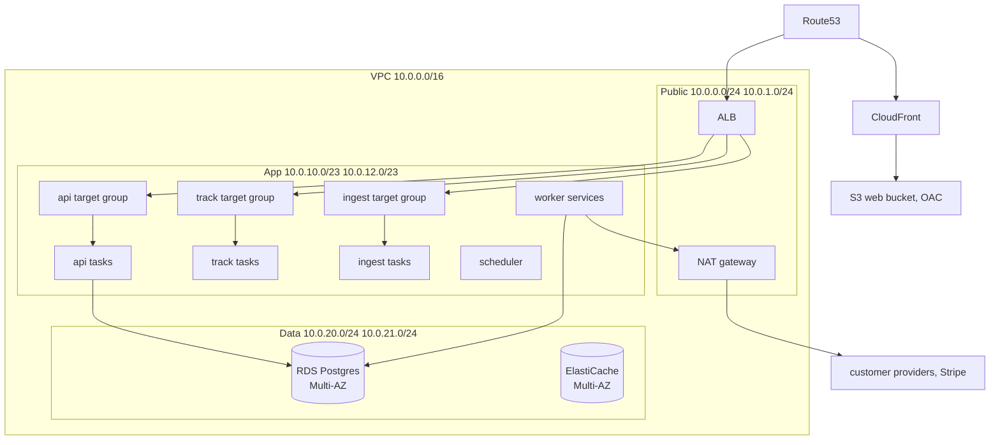

<!-- Infrastructure, deployment and observability -->
> **Source of truth note.** This file is extracted from the Technical Design Document v0.1. Where it conflicts with `docs/17-review-findings.md` or `INVARIANTS.md`, those two files win — they contain the corrections from the independent adversarial review. Implement the corrected design, not the original where they differ.

# 18. Infrastructure, deployment and observability

ECS Fargate in two environments, one AWS account per environment, Terraform for everything. No EC2 instances to patch, no Kubernetes to learn.

## AWS topology



| Layer | Choice | Reason |
| --- | --- | --- |
| DNS | Route53, health-checked failover records |  |
| CDN | CloudFront for the SPA and tracking assets, OAC to a private S3 bucket | Tracking pixel served from an edge is measurably faster and takes load off `track` |
| LB | ALB, path-routed: `/api/*` → api, `/o/*` `/c/*` `/u/*` → track, `/webhooks/*` → ingest | Path routing means one ALB, three target groups, three scaling profiles |
| Compute | ECS Fargate, ARM64 (Graviton) | \~20% cheaper per vCPU, and Node runs fine on ARM |
| DB | RDS Postgres 16, Multi-AZ, gp3, Performance Insights on | Multi-AZ from day 1 in production; single-AZ in staging |
| Cache/queue | ElastiCache Redis 7, replication group, Multi-AZ, automatic failover |  |
| Objects | S3: uploads (private, lifecycle to IA at 30d), exports (presigned, 7d expiry), event archive (Glacier IR at 90d) |  |
| Secrets | Secrets Manager for provider credentials and app secrets; Parameter Store for non-secret config |  |
| Registry | ECR with image scanning and a lifecycle policy keeping 30 images |  |
| Email (ours) | SES for transactional product email, in a separate account identity from any customer's | Never send product email through a customer's provider |

**Subnet policy:** public subnets contain only the ALB and NAT. App tasks are private with NAT egress. Data subnets have no route to the internet at all and only accept from the app security group on 5432 and 6379.

**Cost note:** NAT gateway data processing is a real line item when workers call provider APIs millions of times. Use VPC endpoints for S3, Secrets Manager, ECR, CloudWatch Logs and SQS so only genuine third-party traffic crosses NAT.

## Environments

|  | Staging | Production |
| --- | --- | --- |
| Account | separate AWS account | separate AWS account |
| RDS | `db.t4g.medium`, single-AZ, 7-day backups | `db.r7g.large`+, Multi-AZ, 30-day backups, PITR |
| Redis | `cache.t4g.micro`, 1 node | `cache.r7g.large`, 2 nodes Multi-AZ |
| Fargate | 1 task per service | min 2 per service, across AZs |
| Data | Synthetic and anonymised only. **Never a production dump** |  |
| Payment provider | Stripe test mode | Stripe live |
| Email providers | Sandboxed SES plus a mail-catcher | Real |

## Docker

One multi-stage Dockerfile per app, \~150 MB final image on `node:22-alpine`:

> **Phase 0 correction (implemented).** One image for all four process types, not one per
> app. CLAUDE.md section 2 ("One monorepo, one container image") and the Phase 0 checklist
> both require it and both outrank this file. `infra/docker/Dockerfile` builds it and
> `infra/docker/entrypoint.sh` selects the process from `RELAYD_PROCESS`, execing an
> explicit command when given one — which is how the one-off migration task runs the same
> image as the services. The example below is otherwise accurate, including dumb-init.

```dockerfile
FROM node:22-alpine AS base
RUN corepack enable && apk add --no-cache dumb-init
WORKDIR /app

FROM base AS deps
COPY pnpm-lock.yaml pnpm-workspace.yaml package.json ./
COPY packages/*/package.json packages/
COPY apps/api/package.json apps/api/
RUN pnpm install --frozen-lockfile

FROM deps AS build
COPY . .
RUN pnpm turbo run build --filter=@relayd/api...

FROM base AS runtime
ENV NODE_ENV=production
RUN addgroup -g 1001 app && adduser -S -u 1001 -G app app
COPY --from=build --chown=app:app /app/apps/api/dist ./dist
COPY --from=build --chown=app:app /app/node_modules ./node_modules
USER app
EXPOSE 3000
HEALTHCHECK --interval=30s --timeout=3s --start-period=20s \
  CMD node dist/healthcheck.js
ENTRYPOINT ["dumb-init", "--"]
CMD ["node", "dist/server.js"]
```

`dumb-init` is not optional: without PID-1 signal forwarding, SIGTERM never reaches Node and every deploy kills in-flight jobs after the 30-second Docker grace.

Local development is `docker compose` with Postgres 16, Redis 7, Mailpit, LocalStack (S3, Secrets Manager) and the Stripe CLI forwarding webhooks to `ingest`. Hot reload via `tsx watch` and bind mounts. One command — `pnpm dev` — brings up the whole stack seeded with fixtures.

## Health endpoints

Three distinct checks, because conflating them causes bad restarts:

| Endpoint | Checks | Used by |
| --- | --- | --- |
| `/health` | Process alive only. Never touches dependencies | Docker HEALTHCHECK |
| `/ready` | Postgres `SELECT 1`, Redis `PING`, migration version matches build | ALB target group |
| `/health/deep` | Plus provider reachability, queue depths, replication lag | Monitoring only, never a load balancer |

If `/ready` checked Postgres and Postgres hiccuped, the ALB would drain every task at once and turn a 10-second database blip into a full outage. Keep `/health` dependency-free.

> **Phase 0 correction (scope).** `/ready` currently checks Postgres and Redis only. The
> migration-version comparison and the `/health/deep` endpoint are not implemented: the
> Phase 0 checklist scopes `/ready` to those two dependencies, and both of the others need
> infrastructure that arrives in Phase 10. The dependency-free rule for `/health` is
> implemented and tested.

## CI/CD

```mermaid
flowchart LR
  PR[Pull request] --> LINT[lint + typecheck]
  LINT --> UT[unit tests]
  UT --> IT[integration tests<br/>Testcontainers PG + Redis]
  IT --> SEC[audit + secret scan]
  SEC --> BLD[build images]
  BLD --> MRG{merged to main?}
  MRG -- yes --> ECR[push to ECR]
  ECR --> MIG[migration task on staging]
  MIG --> DSTG[deploy staging]
  DSTG --> SMK[smoke + E2E]
  SMK --> GATE[manual approval]
  GATE --> MIGP[migration task on prod]
  MIGP --> DPRD[rolling deploy prod]
  DPRD --> VER[verify, then auto-rollback on alarm]
```



Build once, promote the same image digest through staging to production. Never rebuild for production — a rebuilt image is a different artifact than the one you tested.

## Migrations

The rule that makes zero-downtime deploys possible: **every migration must be compatible with the currently running application version.** Concretely, expand-then-contract:

| Change | Wrong way | Right way |
| --- | --- | --- |
| Rename a column | `ALTER … RENAME` | Add new, dual-write, backfill, switch reads, drop old in a later release |
| Add a `NOT NULL` column | With no default | Add nullable, backfill in batches, add the constraint `NOT VALID`, then `VALIDATE CONSTRAINT` |
| Add an index | `CREATE INDEX` | `CREATE INDEX CONCURRENTLY` in its own migration, outside a transaction |
| Drop a column | Immediately | Stop writing it in release N, drop it in N+1 |
| Change a type | In place | New column, dual-write, backfill, swap |

Migrations run as a one-off ECS task before the service update, never at app boot (twenty tasks booting simultaneously would race on the migration table). Every migration has a written rollback procedure; an unrollbackable migration must be deployed alone.

**Rollback.** Application rollback is redeploying the previous image digest, under 3 minutes. Database rollback is almost never a down-migration — it is a forward fix. This is exactly why expand-then-contract matters: with it, rolling the app back is always safe because the old code still works against the new schema.

## Backups and disaster recovery

| Target | Value |
| --- | --- |
| RPO | 5 minutes (PITR transaction logs) |
| RTO | 1 hour for a full region-level rebuild |
| RDS backups | Automated daily, 30-day retention, PITR enabled |
| Snapshot copies | Daily cross-region copy to a second region |
| S3 | Versioning on, cross-region replication for uploads and archives |
| Redis | Daily snapshot. Not critical — queue state is reconstructible |
| Terraform state | S3 with versioning and DynamoDB locking |
| Restore drill | **Quarterly, mandatory, timed.** An untested backup is not a backup |

DR runbook covers: full region loss (restore snapshot in the DR region, repoint Route53, \~1 hour), accidental data deletion (PITR clone to a new instance, extract, reinsert — never restore over production), and a bad deploy (rollback digest).

## Observability

Every log line, metric and span carries the correlation set:

```ts
interface TraceContext {
  requestId: string;        // per HTTP request, returned in every response
  traceId: string;          // W3C, spans API to worker to provider
  workspaceId?: string;
  userId?: string;
  jobId?: string;
  campaignId?: string;
  campaignRecipientId?: string;
  providerId?: string;
  providerMessageId?: string;
  // billing
  billingEventId?: string;
  paymentProviderEventId?: string;
  subscriptionId?: string;
  invoiceId?: string;
  paymentId?: string;
}
```

Propagated via `AsyncLocalStorage` in-process and via the job payload's `_trace` field across the queue boundary. The acceptance test for this: given a customer complaint "my email to aisha@example.com never arrived", one query on `campaign_recipient_id` returns the send attempt, the sender used, the provider message id, every provider webhook received, and the log lines from three services — in under a minute.

| Signal | Tool | Notes |
| --- | --- | --- |
| Logs | Pino JSON → CloudWatch Logs → Insights | Structured only; no string interpolation of variables |
| Errors | Sentry, all five services plus the SPA | Release tagging and source maps; `workspaceId` as a tag, never PII |
| Metrics | OpenTelemetry → CloudWatch EMF; Prometheus + Grafana only once someone owns it | Do not run a Prometheus stack you have no one to maintain |
| Tracing | OpenTelemetry, sampled 5%, 100% on errors and all billing operations |  |
| Uptime | External synthetic checks on login, campaign creation, and the webhook endpoint |  |

## Alerts that page

Only these wake someone up. Everything else is a dashboard.

| Alert | Threshold |
| --- | --- |
| `billing-webhook` queue depth | > 50 for 5 min |
| Billing webhook processing failures | any, immediately |
| Usage reconciliation mismatch | any |
| `email-send` failure rate | > 10% over 5 min |
| Dead letters on a critical queue | any |
| API p99 latency | > 2 s for 5 min |
| 5xx rate | > 1% for 5 min |
| DB connections | > 80% of max |
| DB replication lag | > 30 s |
| Redis memory | > 80% |
| Certificate expiry | < 14 days |
| Workspace complaint rate | > 0.3% |

Note what is on that list: three of the twelve are billing correctness. That reflects where the unrecoverable failures are.
